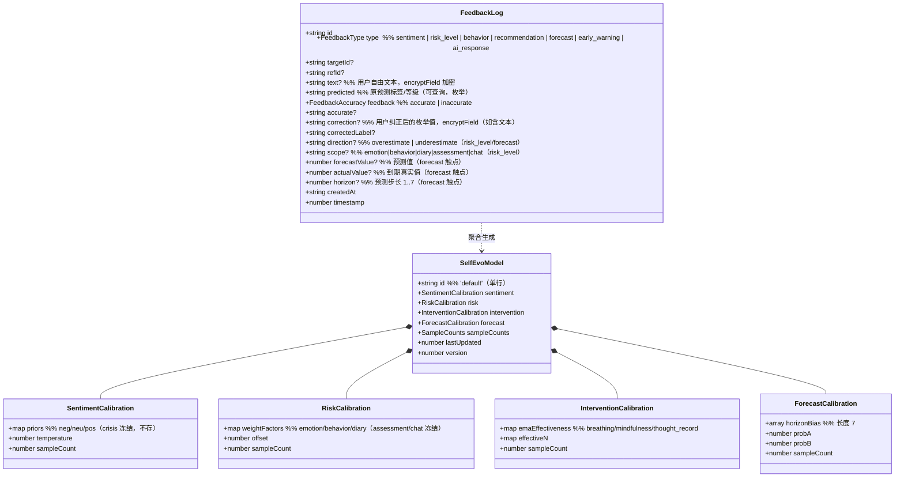
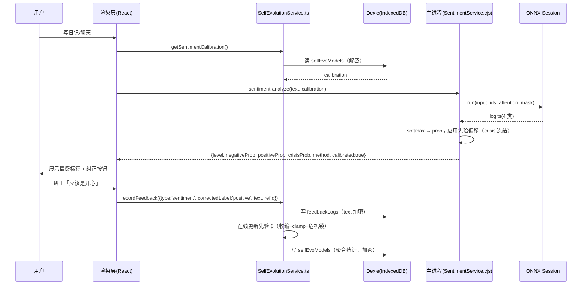

# FriendOS「基于用户反馈的预测准确率自进化」技术方案

> 作者：架构师（高见远）｜ 版本：v1.0 ｜ 仓库：`E:\FriendOS`，源码根：`E:\FriendOS\pc`
>
> 目标：让系统根据用户**本地**提供的纠错/确认反馈，对情感分类、风险评分、行为洞察、干预推荐、趋势预测做**有界、可解释、危机安全锁定**的个性化适配。数据不出本地，不引云，CPU 可跑。

---

## 0. 结论摘要（TL;DR）

1. **不微调 ONNX 模型，也不做 per-user 在线神经网络训练。** 情感分类采用「**用户先验偏移 + 置信度重标定 + 危机通道冻结**」；风险评分采用「**单信号乘法因子 + 全局偏移 + 危机/量表冻结**」；干预推荐用「**带遗忘因子的指数加权有效率（EMA）**」；趋势预测用「**按预测步长的偏差修正 + 概率重标定**」。全部为可解释统计方法，延续 `risk_methodology.md` 的诚实口径。
2. **危机安全是硬约束**：个性化只能把「低/中/高」区间内的等级在有限范围内移动，**永远不能**降低危机灵敏度、不能压过 C-SSRS 急性风险、不能把关键词语义确认降级。危机判定用**未个性化**的基线分数评估。
3. **冷启动与收敛**：反馈样本 < 阈值时回退全局默认；用**收缩（shrinkage）**把个性化结果拉向全局，用**有界 clamp** 防止 1~2 条反馈造成幻觉式误校准；长时间未更新则向全局**漂移衰减**。
4. **数据落地**：反馈正文/纠正内容用 `crypto.ts` 的 `encryptField` 字段级加密；学习参数为聚合统计（无 PII），单独加密存于新增 Dexie 表 `selfEvoModels`。反馈与学习参数**不参与 LAN sync**（v1 明确按「每设备独立学习」处理）。
5. **落地方式**：反馈采集已在渲染层（Dexie）闭环，无需新 IPC 即可写入；个性化参数的「应用」通过给既有纯函数 IPC（`sentiment-analyze` / `emotion:analyzeDiary` / `risk:calculate` / `prediction:getTrend`）增加可选 `calibration` 参数完成，保持服务模块无状态、可单测。

---

## 1. 现状盘点（关键事实，已核源码）

| 项 | 现状 | 文件 |
|---|---|---|
| 情感分类 | 两层：关键词 L1 + ONNX 4 分类 L2（`negative/neutral/positive/crisis`），`analyzeWithONNX` 输出四类 prob，`analyzeEnhanced` 融合关键词并做等级映射 | `pc/electron/services/SentimentService.cjs` |
| 风险评分 | 五信号加权（emotion .30 / behavior .25 / assessment .25 / chat .10 / diary .10）+ 临床升级 safety net（score≥91 / C-SSRS 急性 / 多通道危机） | `pc/electron/services/RiskScoringEngine.cjs` |
| 行为洞察 | 个人基线（≥7 天）均值±1.5σ 异常判定 + 阶梯式 riskFactors，**无反馈闭环** | `pc/electron/services/BehaviorAnalyzer.cjs` |
| 趋势预测 | 线性回归（7 日情绪）+ 逻辑回归（风险升级概率），样本 <8 回退启发式，`method/note` 如实返回，**无反馈修正** | `pc/electron/services/RiskTrendPredictor.cjs` |
| 早期预警 | 3 天窗口特征 + 异常分 + 距临界天数（渲染层） | `pc/src/services/emotion/EarlyWarningService.ts` |
| 干预推荐 | `推荐分 = 规则基础分 × 0.6 + 历史有效率 × 0.4`，有效率 = `有效次数/总次数`（静态比例，无遗忘） | `pc/src/services/emotion/InterventionRecommendationService.ts`、`therapy/EffectivenessService.ts` |
| 反馈存储 | `feedbackLogs` 表（v7）已存在，但字段偏弱（仅 `accurate/inaccurate` 二值 + `text/predicted`），且**落盘未加密**；存在两个 `FeedbackService`（`services/FeedbackService.ts` 与 `services/feedback/FeedbackService.ts`，职责重叠） | `pc/src/db/index.ts`、`models.ts`、两个 FeedbackService |
| 加密 | `crypto.ts` AES-GCM 字段级加密，密钥派生自 app lock 密码，不进 IPC、不进日志 | `pc/src/db/crypto.ts` |
| IPC 模式 | `ipcMain.handle` 注册 → `preload.cjs` `contextBridge` 暴露 → `src/types/electron.d.ts` `ElectronAPI` 补类型 | `main.cjs` / `preload.cjs` / `electron.d.ts` |
| 诚实义务 | `risk_methodology.md` 明确「真 ML 仅 ONNX 情感，其余为可解释统计」，UI 必须带 `method`+`note`+免责 | `docs/risk_methodology.md` |

**两个必须处理的隐性风险点（本次设计顺带修正）**：
- `EmotionAnalysisEngine.analyzeDiary` 直接调 `SentimentService.analyzeWithONNX()`，该函数**只返回 prob、不返回 `level/score/keywords`**，导致 `sentiment?.level` 恒为 `undefined`、`riskLevel` 恒回退 `low`。个性化接线时统一改为走 `analyzeEnhanced()`（返回完整 `level/score/keywords`）。
- `feedbackLogs` 的 `text` 字段可能含用户真实感受文本，目前**明文落盘**，违反「加密本地」铁律，需在写入点加密。

---

## 2. 反馈闭环总设计

### 2.1 五大反馈触点清单

统一采用「**预测结果 → 用户反馈（纠错/确认）→ 本地学习 → 下次预测应用**」闭环。每个触点给出：数据采集点、存储表、加密方式、学习目标。

| # | 触点 | 触发场景（UI 位置） | 反馈语义 | 数据采集点 | 存储表/字段 | 加密 | 学习目标 |
|---|---|---|---|---|---|---|---|
| **F1 情感分类纠错** | 日记/对话下方情感标签（`SentimentBadge`、`FeedbackButtons`） | 用户纠正「这不是焦虑/我其实挺开心」 | 原预测标签 + 用户纠正标签（4 选 1）+ 可选自由文本 | `emotionRecords` 写入后；关联 `refId=emotionRecord.id`、`sourceId=diary.id` | `feedbackLogs`（`type='sentiment'`，新增 `correction`、`correctedLabel`） | `text`/`correction` 用 `encryptField` | 更新情感先验 `β_c`（危机冻结） |
| **F2 风险等级校准** | 风险仪表盘/证据链下方「高估/低估」按钮（`EvidenceChainView`、`RiskDashboardPage`） | 用户判断整体风险等级偏高/偏低，或某一信号偏高/偏低 | 预测等级 + 方向（overestimate/underestimate）+ 可选 `scope`（哪条信号） | `risk:calculate` 返回后；`refId=timestamp` 或 `riskScore` | `feedbackLogs`（`type='risk_level'`，新增 `direction`、`scope`） | 无自由文本；枚举字段明文（可查询） | 更新 `δ` 全局偏移 / `λ_i` 信号因子 |
| **F3 行为洞察对错** | 行为洞察/预警卡片「说得对/不对」 | 用户判定某条洞察（如「深夜活跃异常」「连续未写日记」）对错 | 洞察 id + accurate/inaccurate | 洞察渲染后；`refId=insight.type` | `feedbackLogs`（`type='behavior'`，复用 `accurate`） | 枚举明文 | 更新洞察触发阈值（P2，见 §3.4） |
| **F4 干预有效性** | 每次治疗练习完成后 `moodBefore/moodAfter` + 推荐卡片「这个推荐不适合我」 | 隐式：练习前后情绪差；显式：推荐相关性 | `therapyRecords`（已存在）+ 显式拒绝反馈 | `therapyRecords` 写入后 / 推荐卡交互 | ①`therapyRecords`（已存在，`moodBefore/moodAfter`）；②`feedbackLogs`（`type='recommendation'`） | ②`text` 加密 | 更新 `e_t` EMA 有效率 + 显式惩罚 |
| **F5 情绪预测偏差** | 早期预警/趋势预测卡片「准不准」+ 到期后实际情绪对照 | 用户对「未来 7 天情绪/风险升级概率」的准否反馈；到期后用真实值自动结算 | `EarlyWarningCard`/预测卡反馈按钮；次日情绪真实值 | `prediction:getTrend` 返回后；关联 `forecastHorizon` | `feedbackLogs`（`type='forecast'`，新增 `forecastValue`、`actualValue`、`horizon`） | 数值明文 | 更新 `b_h` 步长偏差 + Platt 概率重标定 |

> 说明：F4 的「有效率」已有隐式数据闭环（`therapyRecords`），本次重点是把它从静态比例升级为带遗忘因子的在线估计（§3.3），并把显式「推荐不相关」反馈作为惩罚信号并入。

### 2.2 统一反馈模型（数据结构）



### 2.3 闭环时序（以「情感纠错 → 先验更新 → 下次应用」为例）



---

## 3. 本地自进化算法选型（不引云、CPU 可跑、模型轻量）

> 约束统一：所有个性化算法均为**可解释统计方法**，绝不声称「神经网络在线训练/AI 自我进化」；`method`/`note`/免责随结果返回；所有参数有界、可收缩、危机单向锁定。

### 3.1 情感分类：**「投票/置信度重标定 + 用户先验偏移」**（推荐），否决在线微调

**结论**：采用输出端校准（对 ONNX 输出的 logits/prob 做用户级重标定），**不做** per-user linear probe 或模型微调。

**理由**：
1. `onnxruntime-node` 的当前计算图只暴露 `logits` 输出；要取 `[CLS]` 中间嵌入做 per-user linear probe，需要**重导出带嵌入头的新 ONNX**，成本高、收益边际（4 分类 + 弱标注噪声 ±10%）。
2. ONNX 4 分类是「真 ML」能力点，`model_card.md`/`eval_report.md` 已锁定其评估口径；在线改动模型权重会破坏可复现性与可解释性。
3. 输出端校准**零模型改动、CPU 开销可忽略、完全可解释**（「把用户历史纠错映射为四类的先验偏移」），与 `risk_methodology.md` 口径一致。

**公式（先验偏移，等效于在 logit 空间加类别偏置）**：

```
z' = [z_neg + β_neg, z_neu + β_neu, z_pos + β_pos, z_crisis]   // crisis 不加偏移
p' = softmax(z')
约束：Σβ = 0（零和，保持分布），|β_c| ≤ B = 1.0（有界）
危机锁：p'_crisis ≡ p_crisis（危机通道完全冻结）
```

**在线更新（每条纠正反馈一条）**：

```
记 预测类 c_pred（argmax），用户纠正为 c*
  β_c*   += η * (1 - p'_c*)          // 增大正确类先验
  β_c_pred -= η * p'_c_pred          // 减小被纠错类先验
  β ← clip(β, -B, +B)；β ← β - mean(β)   // 零和 + 有界
  η = 0.1（学习率），随样本数衰减 η = η0 / (1 + decay * N)
```

**可选 P1：置信度温度重标定**（校准 `confidence` 过自信/欠自信）：`p_i = softmax(z_i / T)`，`T` 用反馈做最小化 NLL 的 1D 搜索（`T ∈ [0.5, 2.0]`）。仅用于 `confidence` 展示，不影响危机判定。

**对等级映射的影响**：`analyzeEnhanced` 中 `crisisProb ≥ 0.5 → crisis` 的判定**用未校准的危机概率**（冻结），`negativeProb/score` 及 medium/high 等级可被校准。保证「再多的『我从不危机』反馈也不会关掉危机雷达」。

### 3.2 风险评分：**单信号乘法因子 + 全局偏移（有界）+ 临床通道冻结**

**结论**：不重训五信号权重（保持 `WEIGHTS` 作为可解释基线），在其上叠加一个「用户校准层」。

**公式**：

```
s'_i = λ_i · s_i                          // 各信号原始分（0-100）
  λ_i ∈ [0.7, 1.3]，init 1.0
  冻结：λ_assessment = 1.0（PHQ-9/GAD-7 临床金标准，不可个性化）
        λ_chat = 1.0（历史通道，冻结）
  可个性化：λ_emotion, λ_behavior, λ_diary
totalScore' = round( clamp( Σ s'_i · w_i + δ , 0, 100 ) )
  δ ∈ [-10, +10]，init 0（全局偏移）
```

**危机单向锁定（硬约束，写进实现与文档）**：
- 临床升级 safety net（`score ≥ 91` / C-SSRS Q3-Q5 急性 / 多通道危机收敛）**始终基于未个性化的基线分数 `totalScore` 与原始 C-SSRS/危机因子评估**，个性化不参与、不得降级。
- 即：个性化只允许在 `low ↔ medium_low ↔ medium ↔ high` 区间移动；**不能凭空制造 critical，也不能把 baseline critical 降级**。

**在线更新（方向性反馈）**：

```
反馈 direction ∈ {overestimate, underestimate}
  if overestimate:  δ -= η_δ
  if underestimate: δ += η_δ
  δ ← clip(δ, -10, +10)
若有 scope（用户点名某信号，如「情绪分析总高估我」）:
  λ_scope = clip(λ_scope ± η_λ , 0.7, 1.3)
η_δ = 1.0, η_λ = 0.05，随样本衰减
```

**可解释性要求（满足 `risk_methodology.md`）**：
- `breakdown` 同时返回**基线权重 `w_i`、原始分 `s_i`、校准因子 `λ_i`、有效分 `s'_i`**，证据链（`EvidenceChainView`）可展示「原始贡献 vs 个性化后贡献」。
- 返回值新增 `calibration: { applied, sampleCount, perSignal: {...}, offset, note }`；UI 必须展示「已根据你的 N 次反馈微调」+ 免责。

### 3.3 干预推荐：**`规则0.6 + 历史有效率0.4` → 带遗忘因子的在线 EMA 有效率**

**结论**：把静态比例 `effectivenessRate = 有效/总数` 换成**指数加权移动平均（EMA）**，等价于「近因加权 + 遗忘因子」，仍走 `规则0.6 + 有效率0.4` 骨架。

**公式**：

```
每次练习会话产出 r_t ∈ {0,1}（moodAfter > moodBefore ? 1 : 0）
e_t = α·r_t + (1-α)·e_{t-1}          // α = 0.3（遗忘因子 1-α = 0.7）
N_t = α + (1-α)·N_{t-1}              // 衰减后的有效样本量（冷启动判据）
推荐分 = (规则基础分 / maxBase) · 6 + e_t · 4
冷启动：N_t < 3 → 回退纯规则（等价于现有 getBestIntervention 的 <3 次回退）
```

**显式负反馈**：推荐卡「这个不适合我」→ `r_t = 0` 直接作为该干预类型的 EMA 更新信号（等效一次「无效会话」），不污染 `therapyRecords`。

**可选 P2：UCB 探索**（防止「永远只推荐历史最优、埋没未试过的有效干预」）：

```
bonus_i = c · sqrt( ln(ΣN + 1) / (n_i + 1) )，c = 0.2，加在推荐分上
```

### 3.4 趋势预测：**按步长偏差修正 + 概率重标定**

**情绪预测（7 日）**：

```
对每步长 h ∈ {1..7} 维护偏差 b_h（EMA）:
  当第 h 日真实情绪可结算（次日/到期）时：b_h = α·(actual_h - forecast_h) + (1-α)·b_h，α = 0.2
预测修正：forecast'_h = round( clamp(forecast_h + b_h, 1, 5) * 10 ) / 10
冷启动：N_forecast < 5 → b_h = 0（全局默认）
```

**风险升级概率（逻辑回归输出）**：

```
Platt 重标定：p' = sigmoid( a · logit(p) + b )
  a ∈ [0.7, 1.4], b ∈ [-0.8, 0.8]，用「准/不准」+ 到期真实升级与否 的反馈做 1D 搜索拟合
冷启动：样本 < 8 → 用原 p（不改），并保持 method='logistic-regression' 且 note 注明未校准
```

**诚实义务**：`method`/`note` 追加「已应用本地校准（N 次反馈）」，UI 引用 `risk_methodology.md` 并带免责。

### 3.5 冷启动与收敛策略（统一，所有模块共用）

| 策略 | 规则 |
|---|---|
| **样本门槛** | 每个模块独立 `N`；`N < N_min`（情感 5 / 风险 8 / 干预 3 / 预测 5）→ 该模块**完全回退全局默认**（参数=0 或 λ=1） |
| **收缩（shrinkage）** | `param_final = global + w · (learned - global)`，`w = min(1, N / N0)`，`N0 = 10`。样本少时自动拉向全局，防幻觉式误校准 |
| **有界 clamp** | 所有参数在定义域内硬 clip（见各节） |
| **漂移衰减（防模型漂移）** | 若某参数 `lastUpdated` 距今 > 30 天，`param ← global + 0.5·(param - global)`（半衰期衰减），并写回 `lastUpdated` |
| **可重置** | 设置页提供「重置个性化学习」入口 → 删除 `selfEvoModels` 单行 + 按需清空 `feedbackLogs` |

---

## 4. 数据与存储设计

### 4.1 新增 Dexie 表

**`selfEvoModels`**（单行，`id='default'`）：

```ts
// pc/src/db/models.ts 新增
export interface SelfEvoModel {
  id: string;                       // 'default'
  sentiment: {
    priors: { neg: number; neu: number; pos: number }; // crisis 不存（冻结）
    temperature: number;            // 默认 1.0
    sampleCount: number;
  };
  risk: {
    weightFactors: { emotion: number; behavior: number; diary: number }; // 默认 1.0
    offset: number;                 // 默认 0
    sampleCount: number;
  };
  intervention: {
    emaEffectiveness: { breathing: number; mindfulness: number; thought_record: number };
    effectiveN: { breathing: number; mindfulness: number; thought_record: number };
    sampleCount: number;
  };
  forecast: {
    horizonBias: number[];          // 长度 7，默认全 0
    probA: number;                  // Platt a，默认 1.0
    probB: number;                  // Platt b，默认 0
    sampleCount: number;
  };
  lastUpdated: number;              // epoch ms
  version: number;                  // 参数结构版本
}
```

Dexie 版本（`index.ts` 追加 v12）：

```ts
this.version(12).stores({
  selfEvoModels: '&id',
});
```

### 4.2 修改 `feedbackLogs` 表字段（向后兼容，不迁移旧数据）

- 新增可选字段：`correction`、`correctedLabel`、`direction`、`scope`、`forecastValue`、`actualValue`、`horizon`。
- 扩展 `type` 联合类型：加 `'risk_level' | 'behavior' | 'forecast'`。
- **索引**：现有 `'&id, type, feedback, createdAt'` 已够用；如需按触点+时间统计，可追加 `[type+createdAt]`（可选）。

### 4.3 加密策略（遵守 `crypto.ts` 字段级约束）

| 字段 | 是否加密 | 理由 |
|---|---|---|
| `feedbackLogs.text`（用户自由文本） | ✅ `encryptField` | 可能含用户真实感受，属敏感内容 |
| `feedbackLogs.correction`（若含自由文本） | ✅ `encryptField` | 同上 |
| `feedbackLogs.predicted / correctedLabel / direction / scope / accurate / type / refId / createdAt / timestamp` | ❌ 明文（枚举/ID/时间） | 需用于统计查询与分组，且不含 PII |
| `selfEvoModels` 整行参数 | ✅ 将参数 JSON `JSON.stringify` 后作为单字段 `encryptField` 加密 | 虽然参数是聚合统计（无原文），但统一满足「加密本地」，成本低（单行读写） |
| `therapyRecords`（moodBefore/After） | ❌（现状即明文） | 为数值型健康指标，现状未加密；如需加密会破坏 `EffectivenessService` 的数值聚合，故本期不改，仅在文档标注为已知边界 |

> 写加密要点：`encryptField` 幂等（`enc::` 前缀检测），重复加密安全；读取用 `decryptField` 对旧明文优雅兼容。加密密钥派生自 app lock 密码，**不进 IPC、不进日志**——因此 `selfEvoModels` 的加解密只能在**渲染层**完成（`SelfEvolutionService.ts`），主进程只接收解密后的 `calibration` 参数（纯数值，非敏感）。

### 4.4 LAN Sync 兼容性

- 现有 sync server 仅透传 `task | diary | memory`（`SyncPayloadItem.type`），**不覆盖** feedback/selfEvo。
- **v1 决策**：`feedbackLogs` 与 `selfEvoModels` **不参与 LAN sync**——个性化学习按「每设备独立」处理，符合「隐私优先」（避免把心理健康反馈在局域网内复制）。`docs/risk_methodology.md` 与 UI 免责中注明「个性化基于本设备反馈，跨设备不共享」。
- **P2 可选**：如需多设备共享，仅同步**加密后的 `selfEvoModels` 聚合参数**（不同步任何原始反馈正文），且复用现有 token 鉴权；此期不实现。

---

## 5. IPC 与类型契约

### 5.1 设计原则

- **反馈写入**：渲染层直接写 Dexie（`SelfEvolutionService.recordFeedback`），**无需新 IPC**。
- **参数应用**：给既有**纯函数**通道加可选 `calibration` 参数，主进程服务保持无状态、可单测，不引入主进程持久化状态。

### 5.2 需要修改的 `ipcMain.handle` 通道

| 通道 | 变更 | 所在 handler |
|---|---|---|
| `sentiment-analyze` | 第 2 参加 `calibration?`，透传 `analyzeEnhanced(text, calibration)` | `main.cjs` |
| `emotion:analyzeDiary` | 第 2 参加 `calibration?`；`analyzeDiary` 内部改走 `SentimentService.analyzeEnhanced(content, calibration)`（顺带修复 level 丢失 bug） | `EmotionAnalysisEngine.cjs` |
| `risk:calculate` | `data.personalization?`，透传 `calculateRiskScore(data, personalization?)` | `main.cjs` |
| `prediction:getTrend` | `input.forecastCalibration?`，透传 `predict(input)`（predict 内部应用） | `main.cjs` |

`preload.cjs` 相应方法补传第 2 个参数（现有封装为固定参数个数，需同步改）。

### 5.3 新增类型（`src/types/electron.d.ts`）

```ts
// 情感校准（crisis 不在此，冻结）
interface SentimentCalibration {
  priors: { neg: number; neu: number; pos: number };
  temperature?: number;
  sampleCount: number;
}

// 风险个性化
interface RiskPersonalization {
  weightFactors: { emotion: number; behavior: number; diary: number };
  offset: number;
  sampleCount: number;
}

// 预测校准
interface ForecastCalibration {
  horizonBias: number[]; // len 7
  probA: number;
  probB: number;
  sampleCount: number;
}

interface ElectronAPI {
  // ...既有...
  sentimentAnalyze: (text: string, calibration?: SentimentCalibration) => Promise<SentimentResult & { calibrated?: boolean }>;
  emotionAnalyzeDiary: (diary: {...}, calibration?: SentimentCalibration) => Promise<EmotionAnalysisResult | null>;
  riskCalculate?: (params: {
    emotionRecords: any[]; behaviorData: Record<string, unknown>;
    assessments: any[]; conversationSummaries: any[]; diaries: any[];
    personalization?: RiskPersonalization;
  }) => Promise<any>;
  predictionGetTrend: (input: RiskPredictionInput & { forecastCalibration?: ForecastCalibration }) => Promise<RiskPredictionResult>;
}
```

---

## 6. 文件级改动点清单

### 6.1 新增文件

| 路径 | 改动要点 |
|---|---|
| `pc/src/services/selfevolution/SelfEvolutionService.ts` | 核心：`recordFeedback()` 写反馈（加密 text）；`computeSentimentCalibration()` / `computeRiskPersonalization()` / `computeInterventionEma()` / `computeForecastCalibration()`；统一实现收缩、clamp、漂移衰减、冷启动回退；读写 `selfEvoModels`（加解密） |
| `pc/src/services/selfevolution/types.ts` | 复用/导出 `SelfEvoModel`、`SentimentCalibration`、`RiskPersonalization`、`ForecastCalibration` 等类型（渲染层侧） |
| `pc/src/services/selfevolution/__tests__/SelfEvolutionService.test.ts` | 单测：先验更新、收缩、clamp、危机锁、冷启动、EMA、漂移衰减 |

### 6.2 修改文件（按模块）

| 路径 | 改动要点 |
|---|---|
| `pc/src/db/models.ts` | 新增 `SelfEvoModel`；`FeedbackLog` 扩展字段与 `type` 联合类型 |
| `pc/src/db/index.ts` | `version(12).stores({ selfEvoModels: '&id' })` |
| `pc/src/services/feedback/FeedbackService.ts` **和** `pc/src/services/FeedbackService.ts` | 合并为一个入口（建议保留 `services/feedback/FeedbackService.ts`，旧文件转发或删除）；`text`/`correction` 写前 `encryptField`；扩展 `logFeedback` 支持纠正/方向/scope/预测值；写完后触发 `SelfEvolutionService` 重算 |
| `pc/src/services/emotion/InterventionRecommendationService.ts` | 用 `emaEffectiveness` 替换静态 `effectivenessRate`；接入 UCB（P2） |
| `pc/src/services/therapy/EffectivenessService.ts` | 增加 `computeEma()`（带遗忘因子）供推荐服务调用；保留 `generateEffectivenessReport` 用于展示 |
| `pc/electron/services/SentimentService.cjs` | `analyzeWithONNX(text, calibration?)`：softmax 前加先验偏移（crisis 冻结）+ 温度；`analyzeEnhanced(text, calibration?)` 透传；导出无破坏 |
| `pc/electron/services/EmotionAnalysisEngine.cjs` | `analyzeDiary` 改走 `analyzeEnhanced`（修复 level bug）+ 透传 calibration |
| `pc/electron/services/RiskScoringEngine.cjs` | `calculateRiskScore(data, personalization?)`：加校准层（λ_i、δ、危机/量表冻结、safety net 用基线分数）；`breakdown` 返回原始分+有效分+因子；`calibration` 元数据 |
| `pc/electron/services/RiskTrendPredictor.cjs` | `predict(input)`：应用 `forecastCalibration`（bias + Platt）；note 注明校准状态 |
| `pc/electron/main.cjs` | 4 个 handler 增参透传；日志沿用 `logInfo`/`logError`（不落原文） |
| `pc/electron/preload.cjs` | 4 个方法补传 calibration/personalization 参数 |
| `pc/src/types/electron.d.ts` | 新增 3 个校准类型 + 扩展 4 个方法签名 |
| `pc/src/components/common/FeedbackButtons.tsx` | 增加「纠正」交互（F1/F2 多选，P1），当前先透传纠正数据到扩展后的 `logFeedback` |
| `pc/src/components/risk/EvidenceChainView.tsx` / `RiskDashboardPage.tsx` | 展示个性化因子 + 「高估/低估」反馈按钮 + 「已按你的反馈校准」提示 + 免责 |
| `pc/src/i18n/translations.ts` | 新增校准/纠正相关文案 key（zh-CN + en） |
| `docs/risk_methodology.md` | 新增「第 9 节 本地个性化自进化」：说明校准层为可解释统计、危机冻结、样本回退、免责口径 |

### 6.3 明确**不改**的部分

- `crypto.ts`：复用既有 `encryptField/decryptField`，不改算法。
- `crisisKeywords.cjs` / C-SSRS / 临床升级：**锁定不动**。
- `BehaviorAnalyzer.cjs` 核心基线算法：P0 不动（F3 行为洞察反馈仅 P2 接入阈值微调）。
- `RiskScoringEngine.cjs` 的 `WEIGHTS` 基线常量：保留为可解释基线，个性化是叠加层。

---

## 7. 风险与合规

| 风险 | 缓解措施 |
|---|---|
| **个性化 vs 可解释性冲突** | 校准层是「基线 + 有界叠加」，UI 同时展示基线权重/原始分/校准因子；`calibration` 元数据 + `note` 随结果返回；`risk_methodology.md` 明确「个性化≠AI 训练，仍是可解释统计」 |
| **幻觉式误校准（1~2 条反馈就大改）** | 收缩 `w=min(1,N/N0)`、有界 clamp、样本门槛回退全局、η 随样本衰减 |
| **危机灵敏度被「我从不危机」反馈削弱** | 危机通道/关键词/C-SSRS/多通道收敛**完全冻结**，只用基线分数评估；`β_crisis` 不参与、`λ_assessment` 冻结 |
| **模型漂移（长期反馈累积导致偏离）** | EMA 遗忘因子 + 30 天漂移衰减 + 设置页可重置 |
| **临床量表被个性化污染** | `λ_assessment = 1.0` 硬冻结，PHQ-9/GAD-7/C-SSRS 永远是权威 |
| **隐私（反馈正文）** | `text`/`correction` 字段级加密；学习参数聚合统计加密存储；不参与 LAN sync；密钥不进 IPC/日志 |
| **免责与法律** | 所有个性化输出沿用「统计预测≠医疗诊断」话术 + 热线；明确「仅用于自我关注与早期提示」 |
| **弱标注噪声（±10%）被放大** | 学习率保守（η 小）、收缩、以及只做「方向/类别」级反馈而非连续值回归，降低对噪声的敏感度 |
| **两个 FeedbackService 职责重叠导致双写/漏加密** | 合并为单一入口，杜绝一处加密一处不加密 |

---

## 8. 实施优先级

### P0（9 月 15 日前可落地的最小闭环）——「情感 + 风险 + 干预」三路闭环

1. 数据层：`selfEvoModels` 表 + `feedbackLogs` 字段扩展 + 反馈正文加密。
2. `SelfEvolutionService.ts`：先验偏移（情感）、λ/δ（风险）、EMA（干预）+ 收缩/clamp/冷启动。
3. 情感：`SentimentService` 先验偏移（危机冻结）+ `EmotionAnalysisEngine.analyzeDiary` 修 bug 走 `analyzeEnhanced`。
4. 风险：`RiskScoringEngine` 校准层（危机/量表冻结）+ breakdown/calibration 元数据。
5. 干预：`EffectivenessService`/`InterventionRecommendationService` 换 EMA。
6. IPC/类型/preload 增参透传；`risk_methodology.md` 增节；最小 UI 反馈（复用现有 `FeedbackButtons` + 加「高估/低估」）。

> 验收：用户连续纠正 N 次情感分类/风险等级后，下次预测在允许范围内向用户偏好方向偏移；危机/C-SSRS 判定不受任何反馈影响；反馈正文落盘为密文。

### P1——「预测修正 + 置信度校准 + 可视化」

1. `RiskTrendPredictor` 步长偏差 + Platt 概率重标定。
2. 情感温度重标定（`confidence` 校准）。
3. UI：纠正多选（情感 4 选 1、风险方向+scope）、「个性化校准」透明面板（展示 λ/δ/先验/样本数 + 重置按钮）。
4. 漂移衰减 + 重置入口落地。

### P2——「探索 + 行为洞察反馈 + 多设备」

1. 干预推荐 UCB 探索。
2. F3 行为洞察对错反馈 → 洞察触发阈值微调（有界）。
3. 可选：加密 `selfEvoModels` 聚合参数跨设备同步（不传原始反馈）。
4. 若外部评估显示「先验偏移收益有限」，再评估 per-user linear probe（需重导出带 `[CLS]` 嵌入的 ONNX）。

---

## 9. 附：类图 / 时序图源文件

- 类图：`deliverables/qingyuanbei/class-diagram.mermaid`
- 时序图：`deliverables/qingyuanbei/sequence-diagram.mermaid`

（内容与上文 §2.2 / §2.3 内嵌图一致。）
