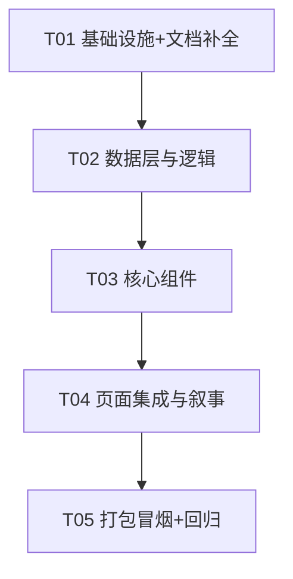

# FriendOS · AI 冲刺任务列表（v2 全新版）

| 项目信息 | 内容 |
|---|---|
| 文档版本 | v2.0（第二次完整执行的独立产物，不覆盖 v1） |
| 撰写人 | 架构师 高见远（Bob） |
| 上游输入 | `架构设计-ai冲刺-v2.md` + `PRD-比赛差距分析-v2.md` |
| 使用说明 | 工程师按 T01→T05 顺序实现；每个任务含**文件路径清单、实现顺序、验收标准**，无需再设计 |

> **硬性规则**：最多 5 个任务；第一个任务必须是项目基础设施/科学文档；每个任务 ≥3 个相关文件；按功能模块分组，不按单文件拆分。
> **重要前提**：现状核实确认主进程侧（ChatFallbackEngine 状态机 / DiagnosticsService / RiskTrendPredictor / BehaviorAnalyzer baseline / 确定性 seedDemoData / electron.d.ts 契约 / 科学文档主体）**均已落地**。本任务列表只覆盖 v2 实际缺口，**禁止重复实现已存在代码**。

---

## 6. 依赖包清单（Required Packages）

**不新增任何运行时第三方依赖**（保持打包体积最小、离线零风险、决赛设备零安装风险）。

| 包 | 状态 | 用途 |
|---|---|---|
| onnxruntime-node ^1.x | 已有（复用） | ONNX 情感模型推理（主进程） |
| zustand ^4.x / dexie ^4.x / dexie-react-hooks | 已有（复用） | 状态 / 本地库 / 响应式查询 |
| recharts ^2.x | 已有（复用） | 趋势图 / Sparkline |
| lucide-react | 已有（复用） | 图标 |
| 新增依赖 | **无** | 证据链纯函数 / 状态机 / 回归 / 冒烟脚本均为纯 JS / TS / Node 内置模块实现 |

---

## 7. 任务列表（Task List）

### T01 · 项目基础设施 + 科学文档补全 + 打包配置核验（P1-3 / P1-4 / 文档补全）

**优先级**：P0 ｜ **依赖**：无 ｜ **实现顺序**：1

**目标**：补齐 v2 缺失的两份文档（30 秒演示路径、离线冒烟清单），更新 docs 索引，为后续任务提供演示脚本与打包验收依据；核验打包配置已含 models。

**文件路径清单**：
| 操作 | 路径 |
|---|---|
| 新增 | `docs/demo_script.md` — 30 秒速览路径（倾诉 5s → 情感识别 5s → 风险看板 10s → 证据链下钻 5s → 危机干预/热线 5s），每步对应具体页面/操作序列；5 分钟视频脚本建议（深夜低落→陪伴→识别→预警→评估→建议→隐私承诺）；素材清单（录屏页面/文案/热线卡）；共用"小明 30 天"故事线 |
| 新增 | `docs/offline_smoke_test.md` — 打包版离线冒烟清单：启动→演示模式注入→对话≥6 轮→风险看板→证据链→危机→退出；每项含操作/预期/结果列；记录打包版路径与执行环境（本机断网模拟或干净 Windows） |
| 修改 | `docs/README.md` — 索引补 `demo_script.md` / `offline_smoke_test.md` |
| 修改 | `pc/package.json` — 增加辅助脚本（可选）：`"docs:smoke": "echo 见 docs/offline_smoke_test.md"` 或冒烟自检 node 脚本入口（不引入依赖） |
| 核验 | `pc/electron-builder.json` — 确认 files 含 `models/**/*`、asarUnpack 含 `models/**/*` + `onnxruntime-*`（已确认存在，T01 只需记录核验结论到 offline_smoke_test.md） |

**实现顺序**：
1. 写 `docs/demo_script.md`（30 秒 + 5 分钟脚本，引用 UI 页面名与数据故事）；
2. 写 `docs/offline_smoke_test.md`（清单模板，结果留 T05 实测回填）；
3. 更新 `docs/README.md` 索引；
4. package.json 补辅助脚本（若需要）。

**验收标准**：
- [ ] `docs/demo_script.md` 可在打包版上逐字走通（页面/按钮/文案与实际 UI 对应）
- [ ] `docs/offline_smoke_test.md` 含完整冒烟清单（≥6 项，每项有操作/预期/结果列）
- [ ] docs/README.md 索引无断链
- [ ] 未动 数据集*/论文/索引/`scripts/train_sentiment/`；未破坏三个源根边界

---

### T02 · 数据层与逻辑（证据链纯函数 + ChatService 会话接线 + i18n 补 key）（P0-6 逻辑 / P0-1 接线 / P2-2 数据源）

**优先级**：P0 ｜ **依赖**：T01 ｜ **实现顺序**：2

**目标**：实现证据链纯函数（黑盒分数→叙事化证据链），打通 ChatService 的无 Key 短路与会话状态回写（离线对话 ≥6 轮不穿帮的关键接线），补预测所需 i18n key。

**文件路径清单**：
| 操作 | 路径 |
|---|---|
| 新增 | `pc/src/utils/evidenceChain.ts` — `buildEvidenceChain(riskResult, hasData)` 纯函数：5 信号贡献（score×weight→contribution，status elevated/normal/no_data）、factors→triggers 中文依据、actions 建议动作（含路由 target）、escalation 复用 diagnostics、disclaimer + methodRef |
| 修改 | `pc/src/services/ai/ChatService.ts` — ① sendMessage 在 chatSend 前先 `chatGetProviderConfig()`，`!hasKey` 直接 `chatFallback`（传 session）并回写 `sessionDelta`，不发起云调用；② 云失败/超时降级路径同样传 session + 回写；③ 危机路径保持现状 |
| 修改 | `pc/src/i18n/translations.ts` — 补 key（zh-CN + en 成对）：`chat.source_local` / `chat.source_cloud`（来源徽标）、`settings.demo_data_clear_btn` / `settings.demo_data_clear_confirm` / `settings.demo_data_clear_success`（清理按钮）、自检面板文案（若 T03 需要）、预测卡 `pred.stat_note` 等 |
| 新增（可选） | `pc/src/utils/__tests__/evidenceChain.test.ts` — 纯函数单测（贡献计算/status 判定/免责恒在） |

**实现顺序**：
1. `evidenceChain.ts`（纯函数，可独立单测）；
2. `ChatService.ts` 无 Key 短路 + session 回写（先看现有 sendMessage 结构，最小改动）；
3. `translations.ts` 补 key；
4. 补 evidenceChain 单测（可选但推荐）。

**验收标准**：
- [ ] `buildEvidenceChain` 对 `{totalScore:72, breakdown:{emotion:{score:80,weight:0.3},...}}` 产出 5 条 contribution 且 Σ(contribution)=totalScore（容差 ±1）；no_data 判定正确；disclaimer 恒定
- [ ] 断网 + 无 Key 时：ChatService **不再调用 chatSend**（无 30s 等待），直接 fallback；`store.session.turnCount` 随轮次递增；第 3 轮回复引用历史主题
- [ ] 连续对话 ≥6 轮情感匹配、无重复模板（ChatFallbackEngine 已有能力，本任务验证接线后生效）
- [ ] `npm run typecheck` 通过；`npm run test` 新增/既有测试全绿

---

### T03 · 核心组件（自检面板 + 证据链视图 + 危机 12356 + 演示清理 + 来源徽标）（P0-2 UI / P0-6 UI / P0-7 / P0-1 徽标）

**优先级**：P0 ｜ **依赖**：T02 ｜ **实现顺序**：3

**目标**：实现全部核心 UI 组件：启动自检面板（四态 + 演示模式入口）、证据链下钻视图、危机热线补 12356、演示数据清理按钮、聊天本地/云端来源徽标。

**文件路径清单**：
| 操作 | 路径 |
|---|---|
| 新增 | `pc/src/components/settings/DiagnosticsPanel.tsx` — 挂载时 `diagnosticsCheck({demoMode})`；四态卡片（联网/模型/Key/降级路径，绿/黄/灰状态灯 + 一句话说明）；断网文案"离线模式-模板对话已就绪（情感感知增强中）"；底部"进入演示模式"主按钮 + 说明 |
| 新增 | `pc/src/components/risk/EvidenceChainView.tsx` — 证据链视图（Modal 或内联展开）：总分+等级 → 5 信号贡献条（宽度=contribution/总分，带数值）→ 触发依据列表 → 建议动作（可跳转路由）→ 免责声明 + 方法说明链接 |
| 修改 | `pc/src/components/risk/RiskScoreCard.tsx` — 增加"查看证据链"按钮（调用 buildEvidenceChain 后打开 EvidenceChainView） |
| 修改 | `pc/src/components/emotion/EarlyWarningCard.tsx` — 预警卡增加"查看证据链"入口（同一 EvidenceChainView） |
| 修改 | `pc/src/components/crisis/CrisisInterventionModal.tsx` — `HOTLINE_KEYS` 改为引用 `utils/constants.ts` 的 `CRISIS_HOTLINES`（含 12356 全国统一心理援助热线），确保三处话术一致 |
| 修改 | `pc/src/components/settings/DataSettings.tsx` — 补"清理演示数据"按钮：`clearDemoData()` + `demoModeStore.deactivate()` + toast；注入按钮补 `activate()` 保持状态一致 |
| 修改 | `pc/src/components/chat/MessageBubble.tsx` — 来源徽标：`method==='fallback'` →「本地」、`method==='cloud'` →「云端」；危机气泡警示色（已有 crisisFlag 判定可复用） |

**实现顺序**：
1. DiagnosticsPanel（先跑通 diagnosticsCheck 数据流）；
2. EvidenceChainView + RiskScoreCard/EarlyWarningCard 入口（依赖 T02 的 evidenceChain.ts）；
3. CrisisInterventionModal 12356（引用 constants）；
4. DataSettings 清理按钮 + MessageBubble 徽标；
5. 补 i18n key（若 T02 未覆盖）。

**验收标准**：
- [ ] 自检面板断网时显示「离线模式-模板对话已就绪（情感感知增强中）」；四态与 diagnosticsCheck 返回值一致；可关闭、可从设置重新打开
- [ ] 任意预警卡/评分卡可下钻证据链；贡献条数值与 riskCalculate 返回一致；无"黑盒分数"观感
- [ ] 危机弹窗/干预资源页显示 12356 + 400-161-9995；话术含"我不能替代专业医疗"
- [ ] DataSettings 可一键注入 + 一键清理；清理后业务表清空、demoModeStore 回到 inactive、刷新不残留
- [ ] ChatPage 消息气泡区分「本地」「云端」来源；危机回复警示色
- [ ] `npm run typecheck` + `npm run test` 全绿

---

### T04 · 页面集成与叙事（风险看板证据链+预测卡、聊天页、设置页、布局、情绪预测数据源）（P0-6 集成 / P2-2 UI / P1-2）

**优先级**：P0（P0-6）/ P1（P1-2）/ P2（P2-2） ｜ **依赖**：T03 ｜ **实现顺序**：4

**目标**：把核心组件接入页面与布局：风险看板完整闭环（评分→证据链→建议）、聊天页会话状态提示、设置页接入自检/隐私面板、布局演示模式徽标、情绪预测卡接入真数据源（method/note 如实展示）。

**文件路径清单**：
| 操作 | 路径 |
|---|---|
| 修改 | `pc/src/pages/RiskDashboardPage.tsx` — 接入 EvidenceChainView（EarlyWarningCard/RiskScoreCard 入口已在 T03 提供，页面负责组装 riskResult 传递）；保留现有基线对比（P2-1 已有内联）；必要时加预测卡容器 |
| 修改 | `pc/src/components/emotion/EmotionPrediction.tsx` — 数据源改为 `predictionGetTrend({dailySeries, personalBaseline})`：展示 riskUpgradeProb / moodForecast7d / riskTrend / confidence / **method 徽标 + note 全文** + "统计学习预测，非诊断"免责 + risk_methodology.md 链接 |
| 修改 | `pc/src/pages/ChatPage.tsx` — 会话状态提示（当前情感/话题 chip，可选 EmotionContextChip 内联实现）；来源徽标（T03 已做 MessageBubble）；降级提示条 |
| 修改 | `pc/src/pages/SettingsPage.tsx` — 接入 DiagnosticsPanel + PrivacyPanel 区块 |
| 新增 | `pc/src/components/settings/PrivacyPanel.tsx` — 隐私可见化：数据只在本机 / AES-GCM 字段加密 / 无网络外联 / API Key DPAPI 加密存储（文案已有 privacy.* key） |
| 修改 | `pc/src/components/layout/AppLayout.tsx` — 演示模式激活时顶部横幅"演示模式 · 数据为模拟数据"；侧边/头部加自检、隐私入口（nav.diagnostics / nav.privacy / nav.demo_mode key 已存在） |

**实现顺序**：
1. EmotionPrediction 接 predictionGetTrend（数据流独立，先行）；
2. RiskDashboardPage 组装证据链闭环；
3. ChatPage 会话状态提示；
4. PrivacyPanel + SettingsPage 接入；
5. AppLayout 演示徽标与入口。

**验收标准**：
- [ ] 风险看板：评分卡/预警卡 → 证据链 → 建议动作可跳转；无半成品/空状态（录屏验证）
- [ ] 预测卡展示 method（如 logistic-regression / heuristic-fallback）+ note；**不出现**笼统"AI 预测"表述；带免责与文档链接
- [ ] 聊天页 ≥6 轮演示连贯；危机文本触发警示气泡 + 危机弹窗
- [ ] 隐私面板展示"数据只在本机 + 加密 + 无外联"；设置页可打开自检面板
- [ ] 演示模式横幅全局可见（激活时）
- [ ] `npm run typecheck` + `npm run test` 全绿

---

### T05 · 打包离线冒烟 + 测试回归 + 结果记录（P1-4 / 全量回归）

**优先级**：P0（保命验证） ｜ **依赖**：T04 ｜ **实现顺序**：5

**目标**：打包版离线冒烟验证（模型进包、无网无 Key 全流程 0 报错），执行全量测试/类型检查回归，把结果如实回填 `docs/offline_smoke_test.md`，确保决赛设备可用。

**文件路径清单**：
| 操作 | 路径 |
|---|---|
| 修改 | `docs/offline_smoke_test.md` — 回填实测结果（打包版路径、环境、每项 pass/fail、截图/日志位置、与预期差异说明） |
| 修改（如必要） | `pc/electron-builder.json` — 若冒烟发现 models 未进包则修正 files/asarUnpack（现状已含，预期无需改） |
| 修改（如必要） | `pc/scripts/external_validation.cjs` / `docs/external_validation.md` — 若有人工盲评结果则回填一致率（否则保持骨架+作者自评，如实标注） |
| 新增（可选） | `pc/electron/services/__tests__/DiagnosticsService.test.cjs`、`pc/electron/services/__tests__/RiskTrendPredictor.test.cjs` — 若现有测试未覆盖则补（现状主进程测试目录已存在，先查缺） |
| 运行 | `npm run test` / `npm run typecheck` / `npm run lint` — 全量回归 |
| 运行 | `npm run dist` 或 `npm run build` + 打包 — 产出安装包用于冒烟 |

**实现顺序**：
1. 查缺补测试（DiagnosticsService/RiskTrendPredictor 若有缺口）；
2. `npm run test` + `typecheck` + `lint` 全绿；
3. 打包（`npm run dist`）；
4. 本机断网模拟冒烟：启动→自检面板→演示注入→对话≥6 轮→风险看板→证据链→危机→清理→退出，逐项记录；
5. 回填 `docs/offline_smoke_test.md`；如有干净离线 Windows 虚拟机则复测一次。

**验收标准**：
- [ ] `npm run test` / `typecheck` / `lint` 全绿（无新增类型错误）
- [ ] 打包版在断网 + 无 Key 环境：启动→演示模式→对话→风险看板→证据链→危机干预→退出 **0 报错**
- [ ] 打包目录/安装包内确认 `models/sentiment/sentiment.onnx` 存在（asarUnpack 生效）
- [ ] `docs/offline_smoke_test.md` 结果列全部填写，差异如实记录
- [ ] `docs/external_validation.md` 一致率状态如实（人工完成则回填，否则标注"待人工/作者自评"）

---

## 8. 共享知识（跨文件约定）

- **类型契约单一来源**：`pc/src/types/electron.d.ts` 的 `ElectronAPI` 是主进程↔渲染层唯一契约；preload 已有全部 v2 通道，**不要新增 IPC**；如确需改动必须同步三处（main.cjs / preload.cjs / electron.d.ts）。
- **对外统一表述**：风险预警 =「多信号可解释风险评估（统计加权）+ 统计早期预警 + ML 情感/危机识别（ONNX 4 分类）」；**禁止**笼统说"AI 预测"；预测展示必须带 `method` + `note` 并引用 `docs/risk_methodology.md`；统一免责"统计预测 ≠ 医疗诊断"。
- **伦理红线**：危机恒走固定回复（热线 12356 + 400-161-9995 + "我不能替代专业医疗"）；三处话术一致：Chat 危机回复（`CRISIS_RESPONSE`）、危机弹窗（`CrisisInterventionModal`）、干预资源页（`constants.CRISIS_HOTLINES` + `CRISIS_DISCLAIMER`）。
- **演示数据确定性**：`seedDemoData.ts` 禁止 `Math.random()`；id 用固定 `demo_*` 前缀；两次运行产出完全一致；注入/清理后 `demoModeStore` 状态同步。
- **会话状态流**：渲染层 `chatStore.session` 是唯一权威；调用 `chatFallback` 时传入，返回 `sessionDelta` 后 `store.updateSession()` 回写；引擎为纯函数，主进程无会话缓存。
- **i18n 规则**：新文案必须加 `TranslationKey` 并同时补 zh-CN + en，否则 `t()` 原样返回 key。
- **沙箱约束**：渲染层不得 `require('electron')` / 访问 Node 模块；一律走 `window.electronAPI`。
- **文档路径**：方法说明 `docs/risk_methodology.md`、模型卡 `docs/model_card.md`、评估报告 `docs/eval_report.md`、外部验证 `docs/external_validation.md`、演示脚本 `docs/demo_script.md`、离线冒烟 `docs/offline_smoke_test.md`。
- **数据安全**：API Key 不进出渲染层（主进程 DPAPI/safeStorage）；敏感数据经 `crypto.ts` 字段加密；日志不含日记原文/Key。

---

## 9. 任务依赖图 + 风险与缓解



**依赖说明**：T01 无依赖（文档独立）；T02 依赖 T01（先有方法学/演示脚本口径）；T03 依赖 T02（证据链纯函数 + i18n key 先行）；T04 依赖 T03（组件就绪后接线）；T05 依赖 T04（全部功能完成后打包验证）。链长 5，符合"尽量独立、仅依赖前序"的约束。

### 风险与缓解

| 风险 | 影响 | 缓解 |
|---|---|---|
| 打包后 ONNX 模型未进包/路径错 | 决赛情感识别不可用（P0-1/P1-4 致命） | T01 先核验 electron-builder.json（已确认含 models + asarUnpack）；T05 冒烟第 1 项即验证模型文件与推理 |
| 无 Key 时仍走云调用等 30s 超时 | 演示卡顿、观感差（P0-1） | T02 无 Key 短路：先 `chatGetProviderConfig()`，无 Key 直接 fallback |
| 会话状态未回写导致离线对话重复/断片 | ≥6 轮不穿帮目标失败（P0-1） | T02 接线 session 传入/回写；ChatFallbackEngine 已有去重与话题引用；T05 冒烟逐轮验证 |
| 证据链数值与 riskCalculate 不一致 | 答辩被追问黑盒（P0-6） | T02 纯函数单测 Σ(contribution)=totalScore；T03 UI 直接用同一份 riskResult |
| 预测 UI 表述过满（说"AI 预测"） | 答辩被击穿"名不副实"（P0-3/P2-2） | T04 强制 method+note+免责+文档链接；共享知识统一话术；T05 评审检查 |
| 危机话术三处不一致（缺 12356） | 伦理红线被质疑（P0-7） | T03 统一引用 `constants.CRISIS_HOTLINES`；验收检查三处热线一致 |
| 外部验证无人力盲评 | P0-5 降级 | 保持骨架+脚本+作者自评，如实标注"待人工"；不夸大指标 |
| 冒烟环境无干净离线 Windows | P1-4 记录差异 | 本机断网模拟为主，offline_smoke_test.md 如实记录环境差异 |

---

## 10. 任务完成顺序速查

```
T01 文档/基础设施 → T02 数据层与逻辑 → T03 核心组件 → T04 页面集成 → T05 打包冒烟回归
每个任务完成前必须：npm run typecheck 通过；涉及测试的任务 npm run test 全绿。
```
