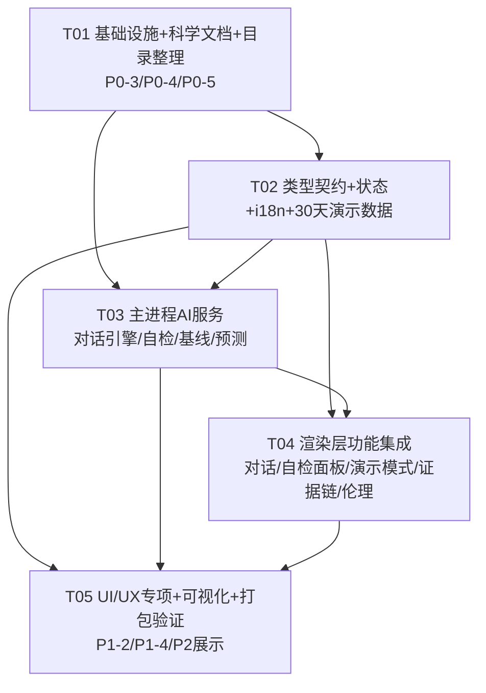

# FriendOS · AI 冲刺任务列表

| 项目信息 | 内容 |
|---|---|
| 文档版本 | v1.0 |
| 撰写人 | 架构师 高见远（Bob） |
| 上游输入 | `架构设计-ai冲刺.md` + `PRD-比赛差距分析.md` |
| 使用说明 | 工程师按 T01→T05 顺序实现；每个任务含**文件路径清单、依赖、实现顺序、验收标准**，无需再设计 |

> **硬性规则**：最多 5 个任务；第一个任务必须是项目基础设施；每个任务 ≥3 个相关文件；按功能模块分组，不按单文件拆分。

---

## 6. 依赖包清单（Required Packages）

**不新增任何运行时第三方依赖**（保持打包体积最小、离线零风险、决赛设备零安装风险）。

| 包 | 状态 | 用途 |
|---|---|---|
| onnxruntime-node ^1.26.0 | 已有 | ONNX 情感模型推理（复用，不新增） |
| zustand ^4.5.0 / dexie ^4.0.0 / recharts ^2.12.0 | 已有 | 状态/本地库/图表（复用） |
| 新增依赖 | **无** | 逻辑回归/线性回归/外部验证脚本均为纯 JS / Node 内置模块实现 |

---

## 7. 任务列表（Task List）

### T01 · 项目基础设施 + 科学文档体系 + 目录整理（P0-3 / P0-4 / P0-5 + 目录整理）

**优先级**：P0 ｜ **依赖**：无 ｜ **实现顺序**：1

**目标**：把"科学依据"做成可交付文档与可运行脚本，并完成目录整理规范（为后续任务提供方法学依据——对话阈值、权重、表述口径都来自这里）。

**文件路径清单**：
| 操作 | 路径 |
|---|---|
| 新增 | `docs/risk_methodology.md` — 5 信号权重依据（0.30/0.25/0.25/0.10/0.10）、风险等级阈值来源（PHQ-9/GAD-7/PSS-10 cutoff 映射）、3 天窗口特征定义、异常分定义、线性回归/移动平均/逻辑回归各自定位；**明示哪些是真 ML（ONNX 情感分类）哪些是统计**；免责"统计预测≠诊断"；PSS-10 出处（Cohen et al., 1983） |
| 新增 | `docs/model_card.md` — 用途/训练数据来源（数据集1 PsyDTCorpus/SoulChat2.0、数据集2 catch_mdpcot/SoulChat-R1、数据集3 distill_psychology-10k-r1、增强+公开数据）、标注方式（如实写关键词弱标注 + R1 reasoning 解析）、指标（同分布 6050 条 accuracy 97.57%、crisis recall 98.87%，从 `pc/models/sentiment/sentiment.eval.json` 复制）、局限性、预期/禁止用途 |
| 新增 | `docs/eval_report.md` — 混淆矩阵（从 eval json 各分类 P/R/F1 反推）、类别指标、错误案例分析（抽样 10 条错误样本展示）、与规则基线对比（keyword-only 方法对比表） |
| 新增 | `docs/external_validation.md` — 外部验证报告骨架：抽样方法（分层抽样 120 条）、评审人、一致率结果占位表、不一致示例占位 |
| 新增 | `docs/目录整理规范.md` — 目录规范（三个源根边界引用 AGENTS.md）+ 新增/移动/清理清单 |
| 新增 | `docs/README.md` — docs 索引 |
| 新增 | `pc/scripts/external_validation.cjs` — 分层抽样 120 条（按 4 类配额）→ 输出 `docs/external_validation/sample.csv`（id,text,model_label）与 `label_sheet.csv`（id,text,空标签列,评审人列）；实现 `--agreement` 模式读回填结果计算一致率并写入报告 |
| 修改 | `pc/scripts/eval-sentiment.cjs` — 增加 `--external-sample N` 模式复用模型对抽样文本出模型标签 |
| 修改 | `pc/package.json` — 增加脚本 `"eval:external": "node scripts/external_validation.cjs"` |
| 修改 | `AGENTS.md` — 更新 docs 布局说明与脚本清单（不改变源根边界） |
| 移动 | `_pdf_extract.txt` → `docs/archive/_pdf_extract.txt`（根目录杂项清理） |

**实现顺序**：
1. 建 `docs/README.md` 与 `docs/` 子目录结构；
2. 依据 `sentiment.eval.json` + train_sentiment 脚本注释撰写 model_card / eval_report；
3. 依据 `RiskScoringEngine.cjs` 权重与阈值注释撰写 risk_methodology；
4. 写 external_validation 脚本 + 报告骨架；
5. 目录整理（移动杂项、更新 AGENTS.md）。

**验收标准**：
- [ ] 4 份科学文档存在且数字与 `sentiment.eval.json`、`RiskScoringEngine.cjs` 一致；文档中"ML vs 统计"边界清晰
- [ ] `npm run eval:external` 可运行并产出 sample.csv + label_sheet.csv + 报告骨架
- [ ] 目录整理规范列出新增/移动/清理清单；**未破坏 AGENTS.md 三个源根边界，未动数据集1/2/3、索引、论文**
- [ ] `npm run typecheck` 仍通过（本任务改动不涉及 src）

---

### T02 · 类型契约 + 状态层 + i18n + 30 天确定性演示数据（全 P0/P1/P2 的地基）

**优先级**：P0 ｜ **依赖**：T01 ｜ **实现顺序**：2

**目标**：定义所有新 IPC/会话/演示/自检/预测/证据链的类型契约，建 demo 状态 store，扩 i18n，把演示数据升级为 30 天确定性可清理。

**文件路径清单**：
| 操作 | 路径 |
|---|---|
| 修改 | `pc/src/types/electron.d.ts` — 新增：`ChatSessionState`、`ChatSessionDelta`、`ChatFallbackResult.sessionDelta`、`DiagnosticsResult`、`RiskPredictionInput/Result`、`EvidenceChain` 系列类型；`ElectronAPI` 新增 `diagnosticsCheck(demoMode)`、`predictionGetTrend(input)`、`behaviorCalculateBaseline(records)`；`chatFallback` 参数扩展 `session?` |
| 修改 | `pc/src/stores/chatStore.ts` — `ChatState` 增加 `session: ChatSessionState`（turnCount/emotionHistory/topics/summary/usedTemplates/dominantEmotion）+ `updateSession(delta)` 方法；`clearMessages` 同时重置 session |
| 新增 | `pc/src/stores/demoModeStore.ts` — `status: 'inactive'\|'active'`、`injectedAt`；`activate()/deactivate()`；持久化 `localStorage['friendos_demo_mode']`；启动时读回 |
| 修改 | `pc/src/utils/seedDemoData.ts` — 扩展为 30 天确定性故事线（正常 10d→压力 8d→焦虑 6d→危机 2d→恢复 4d，含 2 次预警事件）；**移除 `Math.random()` 改用固定打卡表**；导出 `clearDemoData()`；`seedDemoData(flag?)` 写 demo flag |
| 修改 | `pc/src/utils/constants.ts` — 收敛：演示故事常量、热线列表（400-161-9995/12356/010-82951332）、信号权重常量（与 RiskScoringEngine 对齐） |
| 修改 | `pc/src/i18n/translations.ts` — 新增全部文案 key（chat 会话/自检面板/演示模式/证据链/隐私/onboarding/预测），**每个 key 同时补 zh-CN + en** |

**实现顺序**：
1. electron.d.ts 类型（其他文件依赖它编译）；
2. chatStore session + demoModeStore；
3. constants + seedDemoData 扩展；
4. translations 全量补 key。

**验收标准**：
- [ ] `npm run typecheck` 通过（本任务结束时全仓库类型无错）
- [ ] `seedDemoData()` 两次运行产出**完全一致**的数据（确定性）；`clearDemoData()` 清空业务表且保留偏好
- [ ] `demoModeStore` 刷新后状态保持（localStorage 回读）
- [ ] 新增 i18n key 无遗漏（zh-CN/en 成对）；无 `t()` 原样返回 key 的页面
- [ ] electron.d.ts 与 preload/main 的通道一一对应（T03 实现前先定契约）

---

### T03 · 主进程 AI 服务（情感感知对话引擎 + 自检 + 个性化基线 + 风险预测）（P0-1 主进程 / P0-2 主进程 / P2-1 主进程 / P2-2）

**优先级**：P0 ｜ **依赖**：T01、T02 ｜ **实现顺序**：3

**目标**：把 `ChatFallbackEngine` 升级为"情感感知多轮状态机 + 上下文摘要"，新建自检服务与风险预测服务，打通个性化基线 IPC。

**文件路径清单**：
| 操作 | 路径 |
|---|---|
| 修改 | `pc/electron/services/ChatFallbackEngine.cjs` — 按 2.4.1 升级：`respond(text, opts)` 支持 session；状态机 listen→empathize→explore→support→close；情感强度分级（negativeProb/positiveProb/crisisProb）；`extractTopics`；`buildSessionDelta`；会话内模板去重；危机恒走固定回复 |
| 修改 | `pc/electron/services/ChatLLMService.cjs` — `getProviderConfig` 已返回 hasKey；补 `hasUsableKey()` 快捷方法（供自检与短路判断） |
| 新增 | `pc/electron/services/DiagnosticsService.cjs` — `check({demoMode})`：net.isOnline() / SentimentService.getModelStatus() / ApiKeyStore 存在性 / degradationPath / app.getVersion() |
| 修改 | `pc/electron/services/BehaviorAnalyzer.cjs` — `registerHandlers` 已含 `behavior:calculateBaseline`；补 IPC 参数透传（preload 端暴露）；`analyzeBehaviorTrends` 返回个人基线摘要字段 |
| 新增 | `pc/electron/services/RiskTrendPredictor.cjs` — 按 2.4.4：3 天窗口特征 → 逻辑回归风险升级概率 + 线性回归 7 日情绪预测 + confidence + method/note 如实标注；样本 <30 回退启发式 |
| 修改 | `pc/electron/main.cjs` — 注册 `diagnostics:check`、`prediction:getTrend`；`chat:fallback` 透传 session 参数；`behavior:calculateBaseline` 已注册（核对） |
| 修改 | `pc/electron/preload.cjs` — 暴露 `diagnosticsCheck`、`predictionGetTrend`、`behaviorCalculateBaseline` |
| 新增 | `pc/electron/services/__tests__/ChatFallbackEngine.test.cjs` — 6 轮连贯性/情感匹配/危机分支/去重/摘要增长用例（node 环境，createRequire 加载） |
| 新增 | `pc/electron/services/__tests__/RiskTrendPredictor.test.cjs` — 上升序列 prob 高于下降序列；样本不足回退 heuristic；输出字段完整 |

**实现顺序**：
1. ChatFallbackEngine 升级 + 测试（核心，先做）；
2. DiagnosticsService + main/preload 注册；
3. RiskTrendPredictor + 测试；
4. BehaviorAnalyzer baseline 透传。

**验收标准**：
- [ ] `npm run test`（electron 服务测试）全绿；ChatFallbackEngine 6 轮连贯性/去重用例通过
- [ ] 断网 + 无 Key：`diagnostics:check` 返回 `{degradationPath:'template', network:{online:false}, model:{onnxLoaded:true}, apiKey:{hasKey:false}}`
- [ ] `prediction:getTrend` 在演示数据上返回合理 `riskUpgradeProb` + `moodForecast7d[7]` + `method:'logistic-regression'`（或如实回退标注）
- [ ] 新增 IPC 均已同步 `src/types/electron.d.ts`（T02 契约）
- [ ] CSP 未放宽；渲染层未出现 require electron

---

### T04 · 渲染层核心功能集成（多轮对话 + 自检面板 + 演示模式 UI + 证据链 + 伦理红线）（P0-1 渲染层 / P0-2 UI / P0-6 / P0-7）

**优先级**：P0 ｜ **依赖**：T02、T03 ｜ **实现顺序**：4

**目标**：用户可见的 P0 全部落地——离线对话体验、自检面板、演示模式一键注入/清理、风险证据链、危机伦理提示。

**文件路径清单**：
| 操作 | 路径 |
|---|---|
| 修改 | `pc/src/services/ai/ChatService.ts` — 无 Key 短路跳过云调用；`maintainSession` 维护 chatStore.session；`chatFallback` 传 session + 回写 sessionDelta；保留 maybeSummarize |
| 修改 | `pc/src/pages/ChatPage.tsx` — 头部情感/模式 chip（cloud/fallback/emotionLabel）；会话摘要气泡；降级路径提示（复用 chat.offline_mode） |
| 新增 | `pc/src/components/chat/EmotionContextChip.tsx` — 显示当前情感标签 + 模式 + 摘要（数据来自 chatStore.session） |
| 新增 | `pc/src/components/settings/DiagnosticsPanel.tsx` — 自检面板：联网/模型/API Key/降级路径四态卡片 + "离线模式-模板对话已就绪"文案 + 刷新按钮 |
| 修改 | `pc/src/components/settings/DataSettings.tsx` — 演示模式：主按钮"一键注入 30 天演示数据"（调 seedDemoData + demoModeStore.activate）+ 激活横幅 + "清理演示数据"（clearDemoData + deactivate）；确认弹窗防误清空 |
| 修改 | `pc/src/pages/SettingsPage.tsx` — 挂载 DiagnosticsPanel（新 Card） |
| 新增 | `pc/src/utils/evidenceChain.ts` — `buildEvidenceChain(riskResult, hasData)` 纯函数 |
| 新增 | `pc/src/components/risk/EvidenceChainView.tsx` — 5 层证据链视图（分数→信号贡献→触发依据→建议动作→免责） |
| 修改 | `pc/src/pages/RiskDashboardPage.tsx` — `RiskScoreCard`/`EarlyWarningCard` 加"查看证据链"入口；下钻打开 EvidenceChainView |
| 修改 | `pc/src/components/risk/RiskSignalSources.tsx` — 因素行可点击下钻证据链 |
| 修改 | `pc/src/components/crisis/CrisisInterventionModal.tsx` + `pc/src/components/crisis/HotlineCard.tsx` — 补 12356 热线 + "我不能替代专业医疗"统一话术 + 资源列表 |
| 修改 | `pc/src/pages/TherapyPage.tsx` — 干预资源区（热线 + 就近就医提示 + 免责） |

**实现顺序**：
1. ChatService 短路 + session 维护（先让对话体验闭环）；
2. DiagnosticsPanel + Settings 挂载；
3. DataSettings 演示模式 + 横幅 + 清理；
4. evidenceChain.ts + EvidenceChainView + 看板下钻；
5. 危机伦理完善。

**验收标准**：
- [ ] 断网 + 无 Key：Chat 演示 ≥6 轮连贯、情感匹配、无重复模板；**无 30s 云超时等待**（短路生效）
- [ ] 演示模式：点击后 30 秒内各页面有数据；横幅显示"演示模式"；清理后业务表为空、偏好保留
- [ ] 自检面板断网时明确显示"离线模式-模板对话已就绪"
- [ ] 任意预警卡片可下钻证据链；无"黑盒分数"观感；免责声明可见
- [ ] 危机文本路径：弹窗含 12356 + 400-161-9995 + "不替代专业医疗"；干预资源页可展示
- [ ] `npm run typecheck` + `npm run test` 通过；i18n 新 key 成对

---

### T05 · UI/UX 专项 + 个性化基线/预测可视化 + 稳定性打包验证（P1-2 / P1-4 / P2-1 展示 / P2-2 展示）

**优先级**：P1 ｜ **依赖**：T02、T03、T04 ｜ **实现顺序**：5

**目标**：体验可传播（情绪可视化/看板叙事化/onboarding/隐私可见化/统一空态加载态），把 P2 能力"讲出来"，并完成打包版离线验收。

**文件路径清单**：
| 操作 | 路径 |
|---|---|
| 修改 | `pc/src/pages/EmotionPage.tsx` — 组装：月历热力图 + Sparkline 趋势 + 情绪分布 + 个人基线 vs 当前 + 7 日预测 |
| 修改 | `pc/src/components/emotion/EmotionHeatmap.tsx` / `MoodHeatmap.tsx` — 月历热力图（校验/对齐），动效走 reduceMotion |
| 修改 | `pc/src/components/emotion/EmotionTrend.tsx` — Sparkline 趋势线 |
| 修改 | `pc/src/components/emotion/EmotionPrediction.tsx` — 调 `predictionGetTrend` 展示 7 日预测 + 风险升级概率 + method/note 如实展示 |
| 修改 | `pc/src/components/emotion/EarlyWarningCard.tsx` — 预警叙事化（"为什么预警"摘要 + 证据链入口） |
| 修改 | `pc/src/components/common/OnboardingTour.tsx` + `pc/src/App.tsx` — 3 步 onboarding 接线（首次使用引导） |
| 新增 | `pc/src/components/settings/PrivacyPanel.tsx` — 隐私可见化：数据只在本机说明 + 加密方式（AES-GCM/PBKDF2）+ 本地存储位置 + 不联网声明 |
| 修改 | `pc/src/components/layout/AppLayout.tsx` — 隐私徽标（nav.data_local 强化）+ 演示模式徽标 + 自检入口 |
| 修改 | `pc/src/components/common/EmptyState.tsx` / `LoadingPage.tsx` / `LoadingSpinner.tsx` — 统一空状态/加载态（消除半成品感） |
| 修改 | `pc/src/index.css` — 新增动效统一走 `reduceMotion.ts`（不直接 matchMedia） |
| 修改 | `pc/src/pages/SettingsPage.tsx` — 挂载 PrivacyPanel |
| 修改 | `pc/electron-builder.json` — `extraResources` 确认 `models/`（ONNX+vocab）进入打包；dist 脚本校验 |
| 修改 | `pc/scripts/package-manual.js` — 手工打包包含 `pc/models/` |
| 新增 | `docs/offline_smoke_test.md` — 干净离线 Windows 冒烟清单（启动→演示模式→各页面→退出→数据可查） |

**实现顺序**：
1. 情绪可视化三件套 + 预测展示（P2 叙事）；
2. onboarding + 隐私面板 + 空态/加载态统一；
3. 打包配置（models 进包）；
4. 离线冒烟测试清单 + 实际跑一遍。

**验收标准**：
- [ ] UI/UX 完成 ≥5 项（热力图/Sparkline/分布/看板叙事/onboarding/隐私/空态加载态）
- [ ] EmotionPage 可见"个人基线 vs 当前"与 7 日预测；预测卡片标注 method 与"统计预测≠诊断"
- [ ] onboarding 3 步可走通；隐私面板如实说明本地存储与加密；无空状态/错位/半成品页面
- [ ] `npm run dist` 产物在干净离线 Windows 冒烟通过（启动→演示模式→各页面→退出）
- [ ] `npm run test` + `typecheck` 全绿；i18n 无遗漏

---

## 8. 共享知识（跨文件约定）

- **类型契约单一来源**：`pc/src/types/electron.d.ts` 的 `ElectronAPI` 是主进程↔渲染层唯一契约。preload 新增方法、main.cjs 新增 `ipcMain.handle` 必须同步更新此文件，否则 typecheck 失败。
- **CSP 不放松**：生产 CSP `connect-src 'self'` 保持不变；一切云 LLM 调用由主进程 Node fetch 代理（现有架构），渲染层绝不持有 API Key。
- **渲染层禁 Node**：不 `require('electron')`、不访问 Node 模块；一律 `window.electronAPI`。
- **i18n 强制**：任何新增文案必须加 `TranslationKey` + zh-CN + en；缺失时 `t()` 原样返回 key（易穿帮）。
- **动画降级**：新动效统一走 `src/utils/reduceMotion.ts` 的 `shouldReduceMotion()`/`prefersReducedMotion()`；禁止直接 `window.matchMedia('(prefers-reduced-motion: reduce)')`。
- **日志**：主进程错误用 `logError(op, err, extra)` / `logInfo(op, extra)` 单行 JSON；不落日记原文、不落 API Key。
- **日期**：统一 `src/utils/date.ts`（getToday/getDaysAgo），ISO 格式。
- **演示数据确定性**：`seedDemoData` 禁止 `Math.random()`（固定打卡模式表），保证两次注入一致。
- **方法学诚实**：任何"预测/预警"展示必须带 `method` + `note`，引用 `docs/risk_methodology.md`；对外表述统一为"多信号可解释风险评估 + 统计早期预警 + ML 情感/危机识别"，**不说"AI 预测"**；一律带"统计预测≠诊断"免责。
- **伦理**：危机文本恒走固定回复（热线 + 安全确认 + 不替代专业医疗），不允许模板随机化绕过。
- **测试**：electron `.cjs` 服务测试用 vitest `node` 环境 + `createRequire`；渲染层用 jsdom + fake-indexeddb；新测试放 `__tests__/`。
- **目录边界**：只改 `pc/src`、`pc/electron`、`pc/scripts`、`docs/`；**不动** `数据集1/2/3`、`索引/`、`论文/`、`pc/scripts/train_sentiment/`（独立训练脚本）。

---

## 9. 任务依赖图（Task Dependency Graph）

**依赖说明**：
- T02 依赖 T01（方法学/目录先定，类型里的"方法说明链接"指向 T01 文档）。
- T03 依赖 T01（引擎阈值/权重依据来自 risk_methodology）+ T02（类型契约）。
- T04 依赖 T02 + T03（消费新 IPC 与 store）。
- T05 依赖 T02/T03/T04（展示 P2 能力需先有预测服务与证据链）。
- **可并行**：T02 与 T03 中"BehaviorAnalyzer baseline 透传"、"ChatLLMService 小改"可在 T02 类型就绪后立即开工；文档类（T01）可与 T02 并行推进。

---

## 10. 风险与缓解

| 风险 | 缓解 |
|---|---|
| 任务量大、5 个任务粒度粗 | 每个任务内部已列实现顺序；工程师按顺序逐文件推进，先绿测试再补 UI |
| 对话模板仍显机械 | 状态机 + 引用历史主题 + 会话内去重 + 情感强度分级已是最低成本上限；演示脚本（PM P1-3）兜底 |
| 外部验证无人评审 | 脚本+骨架先交付；结果占位，如实标注"作者自评"降级方案 |
| 打包体积（ONNX 104MB） | 已有 `app.asar.unpacked` 机制；T05 校验 extraResources，不改动模型本身 |
