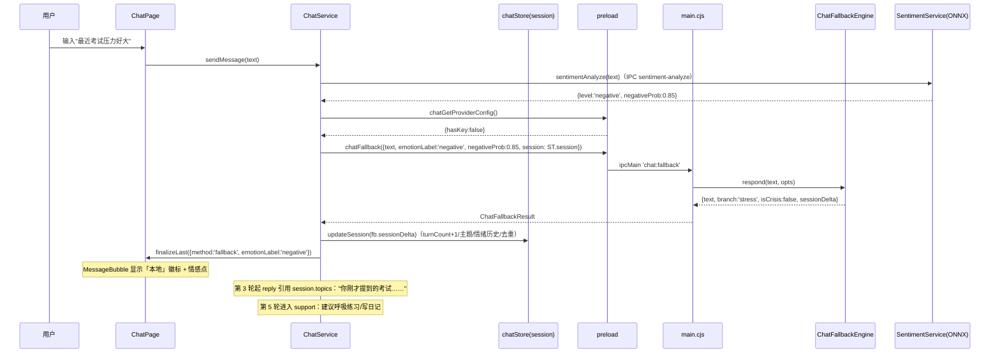
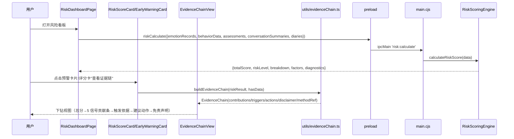
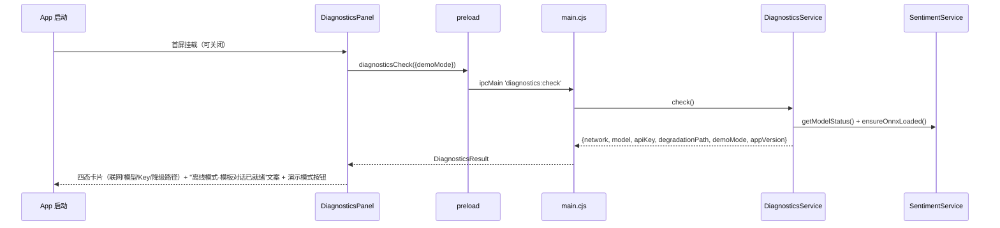
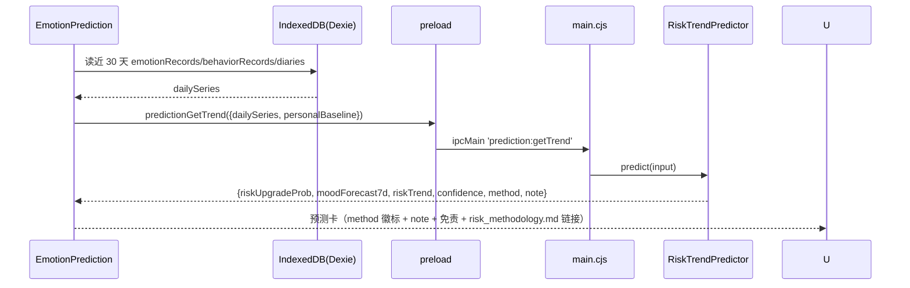

# FriendOS · AI 冲刺系统架构设计（v2 全新版）

| 项目信息 | 内容 |
|---|---|
| 文档版本 | v2.0（第二次完整执行的独立产物，不覆盖 v1） |
| 撰写人 | 架构师 高见远（Bob） |
| 上游输入 | `PRD-比赛差距分析-v2.md`（P0×7 / P1×3 / P2×2）+ 主理人已拍板决策 + `现状调研摘要-团队共享.md` |
| 目标 | 决赛现场（无网、无 API Key）演示不穿帮、答辩可自证科学依据、评分项最大化 |
| 技术栈 | Electron 42 + React 18 + TypeScript + Vite + Dexie + Zustand + Tailwind CSS 3（纯本地桌面应用，复用现有 recharts / onnxruntime-node） |

---

## 0. 主理人已拍板决策（本设计的前提，直接采用）

1. **对话方案**：情感感知模板引擎 + ONNX 4 分类情感驱动 + 会话状态机，**不做本地真小模型**（不引入 GGUF/Qwen）；云 Key 存在时自动增强（保留 ChatLLMService 云链路）。
2. **P2 简化版**：真 ML 预测 + 个性化基线都做简化版（纯 JS 逻辑回归/线性回归 + 规则），必须如实标注"哪些是真 ML、哪些是统计"。
3. **不新增运行时第三方依赖**：状态机/回归/外部验证脚本全部纯 JS / Node 内置模块实现。
4. **默认技术栈**：Electron 42 + React 18 + TS + Vite + Dexie + Zustand + Tailwind 3（复用现有 recharts/onnxruntime-node）。
5. **类型契约单一来源**：`pc/src/types/electron.d.ts` 的 `ElectronAPI` 接口是主进程↔渲染层唯一契约。
6. **只改** `pc/src`、`pc/electron`、`pc/scripts`、`docs/`；不动 数据集*/论文/索引/`scripts/train_sentiment/`。
7. **演示数据确定性**：seedDemoData 禁止 `Math.random()`。

---

## 1. 现状核实结论表（架构师逐文件勘察，2026-08-02）

> 结论：上轮中断前**主进程侧与数据层大部分已落地**；v2 的实质增量集中在**渲染层 UI、集成接线与打包冒烟验证**。工程师应按本表"结论"列决定 复用 / 修改 / 新增，避免重复实现。

| # | 核实项 | 现状（已读代码确认） | 结论 |
|---|---|---|---|
| 1 | **ChatFallbackEngine 当前结构** | `pc/electron/services/ChatFallbackEngine.cjs`（433 行）**已是完整情感感知多轮状态机**：`respond(text, opts)` 支持新签名（opts.session / negativeProb / positiveProb / crisisProb / now）、`stateStage` 六阶段（init→listen→empathize→support→close）、`buildSessionDelta` 生成 sessionDelta、`extractTopics` 主题提取、`usedTemplates` 会话内去重、`detectCrisis` 关键词层危机检测、危机恒走 `CRISIS_RESPONSE`（含 400-161-9995 + 12356 + 不替代专业医疗）、时间感知问候 `greeting(opts)`。纯函数无模块级状态 | ✅ **复用，不重做**。仅需确认前端按新签名调用（见 #2） |
| 2 | **ChatService 流程** | `pc/src/services/ai/ChatService.ts`：sendMessage 流程 = 写 user → sentimentAnalyze（debounce 300ms）→ crisis 则弹危机窗+固定回复 → recordChatEmotion → `chatSend` 流式 → 失败/超时降级 `chatFallback` → 落库 → 每 10 轮摘要。**已维护 session**（chatStore 有 createEmptySession/mergeSessionDelta）但 **sendMessage 尚未把 session 传入 chatFallback**，且**无"无 Key 短路"**（总是先走 chatSend 等 30s 超时） | ⚠️ **修改**（T02）：① 先 `chatGetProviderConfig()` 无 Key 直接走 fallback（省 30s）；② 调用 chatFallback 时传 `session` 并回写 `sessionDelta` |
| 3 | **seedDemoData 结构** | `pc/src/utils/seedDemoData.ts`（498 行）**已是 30 天确定性故事线**：小明 正常10d→压力8d→焦虑6d→危机2d→恢复4d；**已移除 Math.random()**（固定打卡模式表）；确定性 id（demo_*）；含 2 次预警事件（-7 PHQ-9 中重度 / -4 危机日记）；导出 `seedDemoData(flag?)` + `clearDemoData()`；故事含 PSS-10（-1 天 16 分中等压力） | ✅ **复用，不重做**。缺口：DataSettings 只有"填充演示数据"按钮，**缺"清理演示数据"按钮**（clearDemoData 未接线）→ T03 |
| 4 | **BehaviorAnalyzer IPC** | `pc/electron/services/BehaviorAnalyzer.cjs` 已有 `calculateBaseline`（≥7 天，mood/taskCompletion/habitConsistency 均值±std）与 `analyzeDailyBehavior(record, context, baseline)` 异常判定（>1.5×std）；`pc/electron/main.cjs` 已注册 `behavior:analyzeDaily/analyzeTrends/generateSummary/calculateBaseline` 四通道；`preload.cjs` 已暴露 `behaviorCalculateBaseline(records)`；`electron.d.ts` 已有类型 | ✅ **复用，不重做**。个性化基线（P2-1）已具备主进程能力，前端只需接线展示 |
| 5 | **main.cjs / preload.cjs 现有通道** | main.cjs 已注册：`sentiment-analyze`、`chat:send/testConnection/getProviderConfig/fallback/greeting`、`diagnostics:check`（已存在！）、`prediction:getTrend`（已存在！）、`risk:calculate/getTrend/notify`、`behavior:*` 四通道、`api-key-*`、backup/存储/Hello 等；preload.cjs 已暴露 `diagnosticsCheck`、`predictionGetTrend`、`chatFallback(params)`（新签名）、`behaviorCalculateBaseline`。**P0-2 自检与 P2-2 预测的主进程服务已注册** | ✅ **主进程侧零新增 IPC**。渲染层 UI 直接调用即可 |
| 6 | **DiagnosticsService / RiskTrendPredictor** | `pc/electron/services/DiagnosticsService.cjs`（80 行）已实现：network(`net.isOnline()`)/model(触发 ONNX 加载)/apiKey(存在性+provider 不泄露)/degradationPath(cloud|template)/demoMode/appVersion；`pc/electron/services/RiskTrendPredictor.cjs`（304 行）已实现：线性回归闭式解 + 逻辑回归梯度下降(L2) + 3 天窗口特征 + 启发式回退（<8 带标签窗口），method/note 如实返回 | ✅ **复用，不重做**（主进程侧）。前端 UI 缺失见 #8 |
| 7 | **electron.d.ts 现有契约** | `pc/src/types/electron.d.ts` **已含全部 v2 类型**：`ChatSessionState/Delta`、`ChatFallbackResult.sessionDelta`、`DiagnosticsResult`、`RiskPredictionInput/Result`、`EvidenceChain/Contribution/Trigger/Action`、`ElectronAPI.diagnosticsCheck/predictionGetTrend/behaviorCalculateBaseline/chatFallback(session)` 均已定义 | ✅ **复用，不重做**。证据链类型已备，仅缺渲染层实现（T02） |
| 8 | **渲染层 UI 缺口** | 缺（本次核实确认不存在）：`src/utils/evidenceChain.ts`、`src/components/risk/EvidenceChainView.tsx`、`src/components/settings/DiagnosticsPanel.tsx`、`src/components/settings/PrivacyPanel.tsx`、`src/components/chat/EmotionContextChip.tsx`；`RiskDashboardPage.tsx` 已有 RiskScoreCard/EarlyWarningCard/RiskSignalSources/基线对比（内联）但**无证据链下钻、无预测卡**；`ChatPage.tsx` 无"本地/云端"来源徽标（MessageBubble 已有 method 徽标但无 cloud 文案区分）；`CrisisInterventionModal.tsx` 热线列表**缺 12356**（constants.ts 已有 CRISIS_HOTLINES 含 12356 但 Modal 未引用）；`AppLayout/SettingsPage` 未接入自检/隐私面板 | ⚠️ **v2 主要工作区**：证据链（P0-6）、自检面板（P0-2 UI）、隐私面板（P1-2）、危机 12356（P0-7）、预测卡 UI（P2-2）、演示清理按钮（P0-2） |
| 9 | **electron-builder.json 是否含 models/** | `pc/electron-builder.json`：files 含 `models/**/*`，asarUnpack 含 `models/**/*` + `onnxruntime-node/**/*` + `onnxruntime-common/**/*` + `build/**/*`；`after-pack.cjs` 裁剪体积；`vite.config.ts` base './' | ✅ **配置已满足 P1-4**，需实测确认（T05 冒烟） |
| 10 | **科学文档现状** | `docs/` 已有：`risk_methodology.md`（129 行，ML vs 统计边界清晰）、`model_card.md`、`eval_report.md`、`external_validation.md`（骨架）+ `docs/external_validation/`（sample.csv / label_sheet.csv / model_labels.csv）；`pc/scripts/external_validation.cjs` 已存在，package.json 已有 `eval:external` | ✅ **P0-3/P0-4/P0-5 主体已落地**。缺：`docs/demo_script.md`（P1-3）、`docs/offline_smoke_test.md`（P1-4）、外部队列人工回填（待明确） |
| 11 | **i18n / 状态层** | `translations.ts` 已含 evidence.* / privacy.* / pred.* / crisis.hotline_unified_* / crisis.not_medical / nav.demo_mode / nav.diagnostics / nav.privacy 等 key（zh-CN + en）；`chatStore.ts` 已有 session 字段与 updateSession；`demoModeStore.ts` 已存在（localStorage 持久化） | ✅ **复用**。新增少量 key（演示清理按钮/来源徽标等）随 T03/T04 补齐 |

---

## 2. Part A：系统设计

### 2.1 实现方案（Implementation Approach）

#### 2.1.1 核心难点与对策

| 难点 | 对策（v2） | 对应需求 |
|---|---|---|
| **离线对话不穿帮**（≥6 轮连贯、情感匹配、无重复） | 复用已落地 ChatFallbackEngine 状态机（六阶段 + 情感强度分级 + 话题引用 + 会话内去重）；前端把 `session` 传入/回写 `sessionDelta`（当前缺，T02 补接线）；UI 显示「本地/云端」来源徽标（T04） | P0-1 |
| **答辩追问"预测依据"** | 复用已落地 `docs/risk_methodology.md`（ML vs 统计边界表）+ `model_card.md` + `eval_report.md`；对外统一表述「多信号可解释风险评估 + 统计早期预警 + ML 情感/危机识别」；预测 UI 必须带 `method` + `note`（引用 risk_methodology.md） | P0-3/P0-4/P2-2 |
| **决赛翻车**（无网、无 Key、打包缺模型） | 复用已落地 DiagnosticsService（四态自检）；**新增 DiagnosticsPanel UI**（T03）首屏展示 联网/模型/Key/降级路径；演示数据一键注入/清理（补清理按钮 T03）；P1-4 打包离线冒烟（T05 实测并记录到 docs/offline_smoke_test.md） | P0-2/P1-4 |
| **黑盒分数观感** | **新增** `src/utils/evidenceChain.ts` 纯函数（把 risk:calculate 的 breakdown+factors+diagnostics 转成证据链）+ `EvidenceChainView` UI（T02/T03）：总分 → 5 信号贡献条（数值）→ 触发依据 → 建议动作 → 免责声明 | P0-6 |
| **名实相符**（P2 简化版） | 复用已落地 RiskTrendPredictor（纯 JS 逻辑回归+线性回归+启发式回退）；**新增预测 UI**（T04 接 `predictionGetTrend`，展示 riskUpgradeProb/moodForecast7d/method/note）；文档已如实标注"统计学习模型≠ML" | P2-2 |
| **伦理红线** | 危机恒走固定回复（复用 CRISIS_RESPONSE）；**补 12356 热线**到 CrisisInterventionModal（T03，constants.ts 已有数据源）；统一话术"我不能替代专业医疗" | P0-7 |

#### 2.1.2 框架与库选型

- **不新增任何运行时第三方依赖**（保持打包体积最小、离线零风险、决赛设备零安装风险）。理由：
  - 对话状态机/模板引擎：已纯 JS 实现（ChatFallbackEngine.cjs），零依赖。
  - 逻辑回归/线性回归（P2-2）：已纯 JS 实现（RiskTrendPredictor.cjs），零依赖。
  - 外部验证脚本：已用 Node 内置 `fs` 产出 CSV/Markdown（external_validation.cjs），零依赖。
  - 证据链纯函数：`src/utils/evidenceChain.ts` 纯 TS 实现，零依赖。
- 复用现有：`onnxruntime-node`（情感模型推理）、`zustand`、`dexie`/`dexie-react-hooks`、`recharts`（趋势图）、`lucide-react`（图标）。
- **无新增依赖**（devDependencies 亦不新增；测试沿用 vitest）。

#### 2.1.3 架构模式

- **分层**：渲染层（React + Zustand + Dexie）↔ IPC（preload/contextBridge，沙箱）↔ 主进程服务（.cjs）。类型契约单一来源 `electron.d.ts`。
- **对话状态机**：`ChatFallbackEngine` 保持**纯函数**（无模块级可变状态），会话状态由渲染层 `chatStore.session` 持有并随 `chat:fallback` 传入/回传 `sessionDelta`——可单测、可序列化、断电不丢上下文（现状已符合，仅需前端接线）。
- **自检**：`DiagnosticsService.check()` 聚合主进程侧事实（已实现），渲染层 `DiagnosticsPanel` 只展示（新增）。
- **证据链**：渲染层纯函数 `buildEvidenceChain(riskResult, hasData)` 把 `RiskScoringEngine` 的 `breakdown+factors+diagnostics` 转成叙事化证据链（新增），UI 无黑盒。
- **预测**：渲染层组装 `dailySeries` → `predictionGetTrend`（主进程已实现）→ 展示 `method` + `note`（新增 UI）。
- **演示模式**：`demoModeStore`（已实现）驱动注入/清理状态，`seedDemoData`（已实现确定性）写入，UI 按钮补齐（T03）。

### 2.2 文件清单（File List）

> 变更文件统一标注 `(改)`；新增文件标注 `(新)`；**只列 v2 实际需要动/新增的文件**（已落地且无需改的不列，避免误导工程师重复实现）。

```
docs/
├── risk_methodology.md                    (已存在) P0-3 风险预警方法说明（ML vs 统计、阈值来源）——复用，不重做
├── model_card.md                          (已存在) P0-4 模型卡 ——复用
├── eval_report.md                         (已存在) P0-4 评估报告 ——复用
├── external_validation.md                 (已存在) P0-5 外部验证报告骨架 ——复用，结果待人工回填
├── demo_script.md                         (新) P1-3 30 秒演示路径 + 5 分钟视频脚本建议
├── offline_smoke_test.md                  (新) P1-4 打包版离线冒烟测试清单 + 结果记录
└── README.md                              (改) docs 索引补 demo_script / offline_smoke_test

pc/
├── package.json                           (改) 增加 "demo:smoke" 等冒烟辅助脚本（可选，T05）
├── src/types/electron.d.ts                (已存在) 类型契约已含全部 v2 类型——复用，不重做
├── src/i18n/translations.ts               (改) T03/T04 补少量 key（演示清理/来源徽标/自检文案等，zh-CN+en 成对）
├── src/utils/evidenceChain.ts             (新) P0-6 证据链纯函数：buildEvidenceChain(riskResult, hasData)
├── src/services/ai/ChatService.ts         (改) P0-1 ①无 Key 短路（先 chatGetProviderConfig）②传 session + 回写 sessionDelta
├── src/components/settings/DiagnosticsPanel.tsx (新) P0-2 启动自检面板（四态卡片 + 演示模式按钮区）
├── src/components/settings/PrivacyPanel.tsx     (新) P1-2 隐私可见化面板（本地存储/加密/无网络）
├── src/components/settings/DataSettings.tsx     (改) P0-2 补"清理演示数据"按钮（clearDemoData 接线）
├── src/components/risk/EvidenceChainView.tsx    (新) P0-6 证据链视图（Modal/抽屉，下钻）
├── src/components/risk/RiskScoreCard.tsx        (改) P0-6 增加"查看证据链"入口按钮
├── src/components/emotion/EarlyWarningCard.tsx  (改) P0-6 预警卡增加"查看证据链"入口
├── src/components/emotion/EmotionPrediction.tsx (改) P2-2 接 predictionGetTrend 数据源（method/note 展示）
├── src/components/chat/MessageBubble.tsx        (改) P0-1 本地/云端来源徽标（cloud/fallback 文案区分）
├── src/components/crisis/CrisisInterventionModal.tsx (改) P0-7 热线列表补 12356（引用 constants.CRISIS_HOTLINES）
├── src/pages/RiskDashboardPage.tsx        (改) P0-6/P2-2 接入证据链入口 + 预测卡（个性化基线可复用现有内联）
├── src/pages/ChatPage.tsx                 (改) P0-1 会话状态提示/情感 chip（可选 EmotionContextChip）
├── src/pages/SettingsPage.tsx             (改) P0-2/P1-2 接入 DiagnosticsPanel + PrivacyPanel
├── src/components/layout/AppLayout.tsx    (改) P0-2/P1-2 演示模式徽标 + 自检/隐私入口（nav 已有 key）
└── electron/services/                     (已存在) ChatFallbackEngine/DiagnosticsService/RiskTrendPredictor 均复用，不新增
    （main.cjs / preload.cjs 不新增 IPC，零改动）
```

**明确不改**：`pc/electron/main.cjs`、`pc/electron/preload.cjs`、`pc/electron/services/*`（全部复用）、`pc/scripts/train_sentiment/`、数据集*/论文/索引。

### 2.3 数据结构与接口（类图）

```mermaid
classDiagram
    class ChatSessionState {
        +int turnCount
        +string[] emotionHistory
        +string[] topics
        +string summary
        +string[] usedTemplates
        +string dominantEmotion
    }
    class ChatFallbackEngine {
        <<main process service (已实现,复用)>>
        +respond(text, opts) ChatFallbackResult
        +greeting(opts) ChatGreetingResult
        +detectCrisis(text) boolean
        +extractTopics(text) string[]
        +buildSessionDelta(state, text, label, usedKeys) ChatSessionDelta
        +stateStage(session) string
    }
    class ChatService {
        <<renderer service (改)>>
        +sendMessage(text) Promise~void~
        +buildContext() Promise~ChatContext~
        +maybeSummarize() Promise~void~
        -shortCircuitIfNoKey() Promise~boolean~
    }
    class DiagnosticsService {
        <<main process service (已实现,复用)>>
        +check(extra) Promise~DiagnosticsResult~
    }
    class DiagnosticsResult {
        +string appVersion
        +object network
        +object model
        +object apiKey
        +string degradationPath
        +boolean demoMode
        +number timestamp
    }
    class RiskTrendPredictor {
        <<main process service (已实现,复用)>>
        +predict(input) RiskPredictionResult
        +fitLogistic(features, labels) number[]
        +linearRegression(xs, ys) object
        +forecastMood(series) number[]
    }
    class RiskPredictionResult {
        +float riskUpgradeProb
        +number[] moodForecast7d
        +string riskTrend
        +float confidence
        +string method
        +string note
    }
    class EvidenceChainBuilder {
        <<renderer pure util (新)>>
        +buildEvidenceChain(riskResult, hasData) EvidenceChain
    }
    class EvidenceChain {
        +int totalScore
        +string riskLevel
        +EvidenceContribution[] contributions
        +EvidenceTrigger[] triggers
        +EvidenceAction[] actions
        +object escalation
        +string disclaimer
        +string methodRef
    }
    class DiagnosticsPanel {
        <<renderer component (新)>>
        +run() Promise~DiagnosticsResult~
    }
    class EvidenceChainView {
        <<renderer component (新)>>
        +open(chain: EvidenceChain) void
    }
    class SeedDemoData {
        <<renderer util (已实现,复用)>>
        +seedDemoData(flag?) Promise~Result~
        +clearDemoData() Promise~void~
    }

    ChatService --> ChatFallbackEngine : IPC chat:fallback (session 传入/delta 回写)
    ChatService --> ChatSessionState : owns/merges (chatStore.session)
    ChatFallbackEngine --> ChatSessionState : reads + returns delta
    DiagnosticsPanel --> DiagnosticsService : IPC diagnostics:check
    EvidenceChainBuilder --> EvidenceChain : produces
    EvidenceChainBuilder --> RiskScoringEngine.Result : consumes breakdown+factors+diagnostics
    EvidenceChainView --> EvidenceChain : renders
    EmotionPrediction --> RiskTrendPredictor : IPC prediction:getTrend
    SeedDemoData --> DemoModeStore : activate/deactivate (已实现)
```

### 2.4 关键接口设计（工程师直接实现）

#### 2.4.1 ChatService 升级（P0-1 渲染层，T02）

```ts
// src/services/ai/ChatService.ts —— 仅改 sendMessage 中两处
// ① 无 Key 短路：在"写 user → sentiment → crisis 判定"之后、chatSend 之前插入：
const provider = await API.chatGetProviderConfig();
if (!provider.hasKey) {
  // 不发起云调用（省 30s 超时等待），直接走 fallback，UI 显示"离线模式"
  const fb = await API.chatFallback({ text, emotionLabel, session: store.session });
  store.updateSession(fb.sessionDelta);   // 回写会话增量
  store.finalizeLast({ content: fb.text, method: 'fallback', streaming: false, crisisFlag: fb.isCrisis, emotionLabel });
  store.setProviderStatus('fallback');
  await persistConversation(store.messages);
  return;
}
// ② 降级路径同样传 session 并回写：
const fb = await API.chatFallback({ text, emotionLabel, session: store.session });
store.updateSession(fb.sessionDelta);
```
- 危机路径保持现状（ONNX crisis → 危机弹窗 + 固定回复，不调 LLM）。
- 每次拿到 sentiment 后调用 `store.updateSession({ emotionHistory: [...], turnCount: ... })` 或直接依赖引擎返回的 delta（引擎已生成完整 delta，前端只需回写）。

#### 2.4.2 DiagnosticsPanel（P0-2 渲染层，T03 新增）

```tsx
// src/components/settings/DiagnosticsPanel.tsx
// 挂载时：const res = await window.electronAPI.diagnosticsCheck({ demoMode: useDemoModeStore.getState().status === 'active' });
// 四态卡片：
//   联网  → res.network.online ? 绿"已联网" : 灰"离线"
//   模型  → res.model.onnxLoaded ? 绿"ONNX 就绪" : (res.model.onnxAvailable ? 黄"可用-待加载" : 灰"不可用")
//   API Key → res.apiKey.hasKey ? 绿"已配置" : 灰"未配置"
//   降级路径 → res.degradationPath === 'cloud' ? 绿"云对话可用" : 黄"离线模式-模板对话已就绪（情感感知增强中）"
// 底部：主按钮"进入演示模式"（打开 DataSettings 注入/清理）+ 说明文案
// 入口：App 启动首屏（可关闭）+ SettingsPage 可重新打开
```

#### 2.4.3 证据链（P0-6 渲染层，T02 纯函数 + T03 UI）

```ts
// src/utils/evidenceChain.ts（新增，纯函数，零依赖）
export function buildEvidenceChain(
  riskResult: { totalScore: number; riskLevel: string; breakdown: Record<string,{score:number;weight:number}>; factors: Array<{type:string;description:string}>; diagnostics?: { exclusionsHit: unknown[]; escalation: { escalated: boolean; reasons: string[]; crisisFactorCount: number } } },
  hasData: Record<'emotion'|'behavior'|'assessment'|'chat'|'diary', boolean>
): EvidenceChain
// contributions: 5 信号 { key,label,score,weight,contribution=score*weight,status: elevated|normal|no_data }
//   status 判定：score>=60 → elevated；score===0 && !hasData[key] → no_data；否则 normal
// triggers: 由 factors 映射（factor.type → 中文依据 + source），含 diagnostics.escalation.reasons
// actions: 由触发类型映射：情绪/行为→写日记(/diary/new)、呼吸练习(/therapy?exercise=breathing)、量表评估(/assessment)、危机→热线
// disclaimer: "本评分基于统计规则与 ML 情感识别，不构成医疗诊断"
// methodRef: 'docs/risk_methodology.md'
```

```tsx
// src/components/risk/EvidenceChainView.tsx（新增）
// 分层展示：总分+等级 → 5 信号贡献条（宽度=contribution/总分，数值）→ 触发依据列表 → 建议动作（可跳转）→ 免责声明 + "查看方法说明"（打开 docs 链接）
// 打开方式：RiskScoreCard / EarlyWarningCard 增加"查看证据链"按钮 → 挂载 EvidenceChainView（Modal 或内联展开）
```

#### 2.4.4 预测卡（P2-2 渲染层，T04）

```ts
// EmotionPrediction.tsx（改）—— 数据源从静态/本地改为 predictionGetTrend
const input: RiskPredictionInput = { dailySeries: buildDailySeries(emotionRecords, behaviorRecords, diaries), personalBaseline: await API.behaviorCalculateBaseline(records) };
const result = await API.predictionGetTrend(input);
// 展示：riskUpgradeProb（百分比）、moodForecast7d（Sparkline）、riskTrend、confidence、method 徽标、note 全文
// 硬性要求：method + note 必须展示；文案含"统计学习预测，非诊断"；链接 docs/risk_methodology.md
```

#### 2.4.5 演示模式（P0-2 渲染层，T03）

- `DataSettings.tsx` 补"清理演示数据"按钮：`await clearDemoData(); useDemoModeStore.getState().deactivate(); toast('已清理')`。
- 注入按钮现状：`seedDemoData()` 已接（确认弹窗 + toast）；补 `activate()` 调用保持状态一致。
- `AppLayout` 演示模式激活时顶部横幅"演示模式 · 数据为模拟数据"（nav.demo_mode key 已存在）。

#### 2.4.6 伦理红线（P0-7 渲染层，T03）

- `CrisisInterventionModal.tsx` 的 `HOTLINE_KEYS` 改为引用 `utils/constants.ts` 的 `CRISIS_HOTLINES`（已含 12356 全国统一心理援助热线 + 400-161-9995 + 北京 010-82951332 + 生命热线 400-821-1215 + 希望 24 热线 400-179-1885），确保危机弹窗、干预资源页、聊天危机回复三处话术一致。
- 危机演示路径：聊天输入危机文本 → ONNX crisis → 危机弹窗（热线卡 + "我不能替代专业医疗"）→ 固定回复。

### 2.5 程序调用流程（时序图）

#### 2.5.1 离线多轮对话（无 Key / 断网路径，含 session 回写）



#### 2.5.2 风险证据链下钻（P0-6）



#### 2.5.3 启动自检（P0-2）



#### 2.5.4 7 日预测（P2-2）



### 2.6 待明确事项（Anything UNCLEAR）

1. **外部验证人工资源**：P0-5 报告骨架与脚本已交付；120 条盲评需 2~3 人人工执行（建议 PM/QA/架构师各抽一部分），一致率结果回填 `docs/external_validation.md`——若无人力，降级为"作者自评 + 抽样展示"（如实标注）。
2. **30 秒演示路径与 5 分钟视频**：`docs/demo_script.md` 默认给出 30 秒速览（倾诉→情感识别→风险看板→证据链→危机干预）+ 5 分钟视频脚本建议；是否共用同一故事线（建议共用"小明 30 天"）。
3. **打包验证环境**：P1-4 冒烟默认用本机断网模拟（`docs/offline_smoke_test.md` 如实记录）；QA 如有干净离线 Windows 虚拟机则优先使用。
4. **演示模式入口位置**：默认自检面板首屏 + SettingsPage 数据管理双入口；如需 Welcome 首屏引导可后续微调。
5. **数据合规**：3 个训练数据集（SoulChat2.0 等）开源许可是否允许申报书公开来源与用途——影响 `model_card.md` 数据追溯写法（当前按现状如实写）。
6. **申报书/视频材料归属**：本设计聚焦产品与工程；申报书 PDF 与 5 分钟视频由产品侧提供脚本与素材（见 `demo_script.md` 素材清单）。

---

## 3. 对外表述统一（答辩/UI 共用，P0-3 叙事重构）

> **统一话术**：FriendOS 的风险预警 = **多信号可解释风险评估（统计加权） + 统计早期预警（移动平均/线性回归/逻辑回归） + ML 情感/危机识别（ONNX 4 分类）**。
> **禁止**笼统说"AI 预测"。**必须**带免责："统计预测 ≠ 医疗诊断"。
> 具体哪部分是 ML、哪部分是统计、阈值来源 → 一律以 `docs/risk_methodology.md` 为准。
> 危机恒走固定回复（热线 12356 + 400-161-9995 + 不替代专业医疗）。
