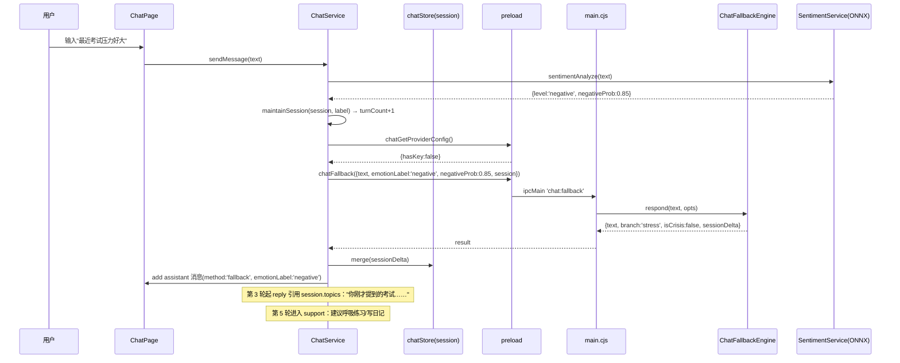
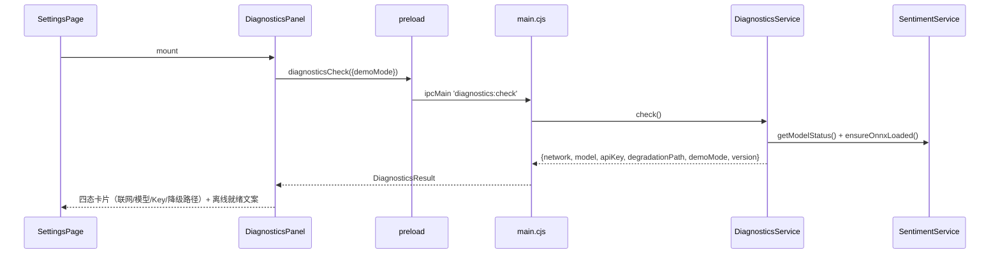
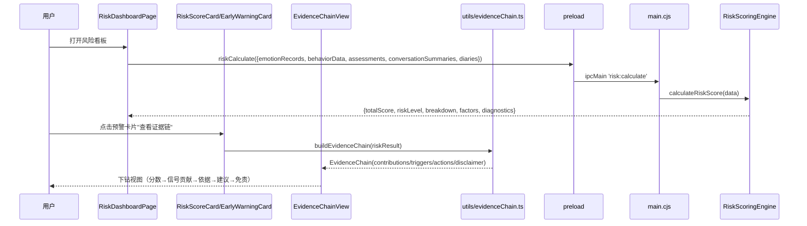
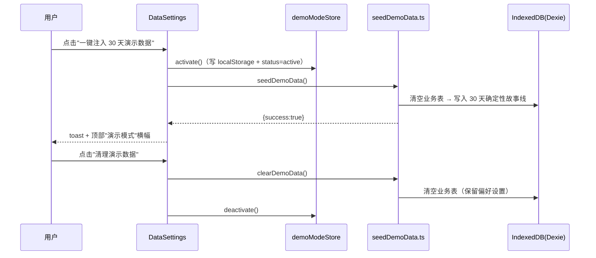

# FriendOS · AI 冲刺系统架构设计

| 项目信息 | 内容 |
|---|---|
| 文档版本 | v1.0 |
| 撰写人 | 架构师 高见远（Bob） |
| 上游输入 | `PRD-比赛差距分析.md`（产品经理 许清楚）+ 主理人已拍板决策 |
| 目标 | 把"名不副实的 AI"修成"能自证、能演示、能讲故事的 AI"（P0 保命 / P1 加分 / P2 简化版加分） |
| 技术栈 | Electron 42 + React 18 + TS + Vite + Dexie + Zustand + Tailwind 3（纯本地桌面应用） |

---

## 0. 主理人已拍板决策（本设计的前提）

1. **对话 AI 兜底方案**：采用 **P0-1 方案 B（情感感知模板引擎）为主**——用已跑通的 ONNX 情感分类（4 类 negative/neutral/positive/crisis）驱动模板回复 + 上下文摘要 + 状态机，离线稳定；云 Key 存在时自动增强（保留现有 ChatLLMService 云链路，自动切换）。**不做本地真小模型**（GGUF/Qwen 不再引入）。
2. **P2 创新点**：真 ML 预测 + 个性化基线 **都做（简化版）**。简化版允许用规则+统计回归实现，但必须在 `docs/risk_methodology.md` 中如实标注"哪些是真 ML、哪些是统计方法"。

---

## 1. 现状核实结论（架构师勘察代码后）

| 项 | 现状 | 结论 |
|---|---|---|
| 情感识别 | `SentimentService.cjs`：关键词 L1 + ONNX L2（4 分类），已跑通；`sentiment-analyze` IPC 已暴露；`sentiment-get-model-status` 已暴露 | ✅ 复用，不重做 |
| 对话降级 | `ChatFallbackEngine.cjs`：按 emotionLabel 分支 + 时间段问候，**无会话状态、无上下文摘要、无去重会话内去重** | ⚠️ 需升级（P0-1） |
| 云对话 | `ChatLLMService.cjs`：主进程 Node fetch 代理，qwen/deepseek，流式 | ✅ 保留；补"无 Key 时跳过云调用直接走模板" |
| 演示数据 | `seedDemoData.ts`：14 天故事线（正常→压力→焦虑→危机→恢复），**含 `Math.random()` 打卡数据（不可复现）**，从 DataSettings 手动触发，无清理函数导出 | ⚠️ 扩展为 30 天确定性 + 一键注入/清理 + Demo 模式状态 |
| 风险评分 | `RiskScoringEngine.cjs`：5 信号加权（情绪 0.30/行为 0.25/评估 0.25/聊天 0.10/日记 0.10），返回 `breakdown + factors + diagnostics`（含排除规则与升级归因） | ✅ 数据齐备，缺"证据链"展示层（P0-6） |
| 风险趋势 | `EmotionPredictionService.ts`（移动平均+斜率）、`EarlyWarningService.ts`（多窗口特征+线性回归+距临界天数） | ⚠️ 全部为统计方法，需在方法说明中如实标注（P0-3） |
| 个性化基线 | `BehaviorAnalyzer.cjs` 已有 `calculatePersonalBaseline` + `analyzeDailyBehavior(record, context, baseline)`，但 **preload 未暴露 `behavior:calculateBaseline`**，Dashboard 基线对比用的是页面内联逻辑 | ⚠️ 打通 IPC + 升级为个人历史基线（P2-1） |
| PSS-10 | `PSS10Form.tsx` 已实现（10 题 5 级、反向计分），`AssessmentPage` 已接线（保存 + 分级 + 历史），`RiskScoringEngine` 已读 PSS10 计入评估信号 | ✅ **P1-1 已完成**，仅需在方法说明/量表出处文档化 |
| 伦理 | `CrisisInterventionModal` + `HotlineCard` 已存在（400-161-9995 热线）；Chat 危机路径固定回复 | ⚠️ 补充 12356 全国统一热线 + "不替代专业医疗"统一话术 + 干预资源页完善（P0-7） |
| 自检 | 无启动自检面板；`sentiment-get-model-status` 只覆盖模型 | ⚠️ 新建 DiagnosticsService（P0-2） |
| 科学文档 | `docs/` 只有 `archive/` | ⚠️ 全部新建（P0-3/P0-4/P0-5） |

---

## 2. Part A：系统设计

### 2.1 实现方案（Implementation Approach）

#### 2.1.1 核心难点与对策

| 难点 | 对策 |
|---|---|
| 离线多轮对话不穿帮（≥6 轮连贯、情感匹配） | 状态机（listen→empathize→explore→support→close）+ 会话上下文摘要 + 情感强度分级匹配 + 会话内模板去重（见 2.4） |
| 答辩"预测依据"被追问 | 三份科学文档（方法说明/模型卡/评估报告）+ 外部验证脚本；对外统一表述"多信号可解释风险评估 + 统计早期预警 + ML 情感/危机识别" |
| 决赛无网无 Key 演示翻车 | 演示模式（30 天确定性数据一键注入/清理）+ 启动自检面板（联网/模型/Key/降级路径四态一目了然） |
| 黑盒分数观感 | 证据链视图：风险分 → 各信号贡献 → 触发依据 → 建议动作 |
| P2 简化版"真预测"名实相符 | `RiskTrendPredictor`（主进程，纯 JS 逻辑回归 + 线性回归），在方法说明中如实标注为"统计学习模型"；真 ML 仍是 ONNX 情感模型 |

#### 2.1.2 框架与库选型

- **不新增任何运行时第三方依赖**（保持打包体积最小、离线零风险）。理由：
  - 对话模板引擎/状态机：纯 JS 实现，零依赖。
  - 逻辑回归/线性回归（P2-2 简化版）：纯 JS 实现（梯度下降/闭式解约 100 行），不引 sklearn/onnx 导出。
  - 外部验证脚本：Node 内置 `fs` 产出 CSV/Markdown，零依赖。
  - 热力图/Sparkline：复用现有 `recharts` + 现有 `EmotionHeatmap/MoodHeatmap/EmotionTrend`。
- 保留现有：`onnxruntime-node`（情感模型）、`zustand`、`dexie`、`react-hot-toast`。

#### 2.1.3 架构模式

- **分层**：渲染层（React + Zustand + Dexie）↔ IPC（preload/contextBridge）↔ 主进程服务（.cjs）。
- **对话状态机**：`ChatFallbackEngine` 保持**纯函数**（无模块级可变状态），会话状态由渲染层 `chatStore.session` 持有并随 `chat:fallback` 传入/回传 `sessionDelta`——可单测、可序列化、断电不丢上下文。
- **自检**：`DiagnosticsService` 聚合主进程侧事实（`net.isOnline()` / ONNX 状态 / API Key / 降级路径），渲染层只展示。
- **证据链**：渲染层纯函数 `buildEvidenceChain(riskResult)` 把 `RiskScoringEngine` 的 `breakdown+factors+diagnostics` 转成叙事化证据链，UI 无黑盒。

### 2.2 文件清单（File List）

> 变更文件统一标注 `(改)`；新增文件标注 `(新)`。

```
docs/
├── risk_methodology.md                    (新) P0-3 风险预警方法说明（ML vs 统计、阈值来源）
├── model_card.md                          (新) P0-4 情感模型卡
├── eval_report.md                         (新) P0-4 评估报告（混淆矩阵/错误分析/规则基线对比）
├── external_validation.md                 (新) P0-5 外部验证报告（骨架 + 结果占位）
├── 目录整理规范.md                         (新) 目录整理规范 + 新增/移动/清理清单
├── offline_smoke_test.md                  (新) P1-4 离线冒烟测试清单（打包版验收）
├── README.md                              (新) docs 索引
└── archive/_pdf_extract.txt               (移) 由根目录移入（根目录杂项清理）

pc/
├── package.json                           (改) 新增 eval:external 等脚本
├── electron-builder.json                  (改) extraResources 确保 models/ 进打包（P1-4）
├── src/types/electron.d.ts                (改) 类型契约单一来源：新增全部 IPC 类型与方法
├── src/stores/chatStore.ts                (改) 会话状态字段（turnCount/emotionHistory/topics/summary）
├── src/stores/demoModeStore.ts            (新) 演示模式状态（inactive/active + 持久化）
├── src/i18n/translations.ts               (改) 全部新文案 TranslationKey + zh-CN + en
├── src/utils/seedDemoData.ts              (改) 30 天确定性数据 + clearDemoData() + seedDemoData(flag)
├── src/utils/constants.ts                 (改) 演示故事/热线/信号权重等常量收敛
├── src/utils/evidenceChain.ts             (新) buildEvidenceChain(riskResult) 纯函数
├── src/services/ai/ChatService.ts         (改) 无 Key 跳过云调用、维护会话状态、sessionDelta 回写
├── src/pages/ChatPage.tsx                 (改) 情感上下文 chip + 会话摘要 + 降级路径提示
├── src/components/chat/EmotionContextChip.tsx (新) 当前情感/模式 chip
├── src/components/settings/DiagnosticsPanel.tsx (新) 启动自检面板
├── src/components/settings/PrivacyPanel.tsx    (新) 隐私可见化面板
├── src/components/settings/DataSettings.tsx    (改) 演示模式一键注入/清理 + 活跃横幅
├── src/pages/SettingsPage.tsx             (改) 接入 DiagnosticsPanel + PrivacyPanel
├── src/components/risk/EvidenceChainView.tsx   (新) 证据链视图（下钻）
├── src/components/risk/RiskSignalSources.tsx   (改) 因素行可下钻证据链
├── src/pages/RiskDashboardPage.tsx        (改) 预警卡片接证据链入口 + 基线展示升级
├── src/components/crisis/CrisisInterventionModal.tsx (改) 12356 热线 + 统一话术
├── src/components/crisis/HotlineCard.tsx  (改) 干预资源列表完善
├── src/pages/TherapyPage.tsx              (改) 干预资源区
├── src/pages/EmotionPage.tsx              (改) 情绪可视化 + 个人基线 vs 当前 + 7 日预测
├── src/components/emotion/EmotionHeatmap.tsx (改) 月历热力图
├── src/components/emotion/MoodHeatmap.tsx    (改) 月历热力图（复用/对齐）
├── src/components/emotion/EmotionTrend.tsx   (改) Sparkline 趋势
├── src/components/emotion/EmotionPrediction.tsx (改) 7 日预测 + 风险升级概率
├── src/components/emotion/EarlyWarningCard.tsx (改) 预警叙事 + 证据链入口
├── src/components/common/OnboardingTour.tsx   (改) 3 步引导
├── src/components/common/EmptyState.tsx       (改) 统一空状态
├── src/components/common/LoadingPage.tsx      (改) 统一加载态
├── src/App.tsx                            (改) onboarding/演示模式引导接线
├── src/components/layout/AppLayout.tsx    (改) 隐私徽标/自检入口
├── src/index.css                          (改) 动效走 reduceMotion
├── electron/services/ChatFallbackEngine.cjs  (改) 情感感知多轮状态机 + 摘要 + 去重
├── electron/services/ChatLLMService.cjs      (改) getProviderConfig 无 Key 短路提示（小改）
├── electron/services/DiagnosticsService.cjs  (新) 自检聚合
├── electron/services/BehaviorAnalyzer.cjs    (改) baseline IPC + 个人基线参与趋势
├── electron/services/RiskTrendPredictor.cjs  (新) 7 日风险升级概率 + 情绪预测
├── electron/main.cjs                     (改) 注册新 IPC
├── electron/preload.cjs                  (改) 暴露新方法
├── electron/services/__tests__/ChatFallbackEngine.test.cjs (新)
├── electron/services/__tests__/RiskTrendPredictor.test.cjs  (新)
├── scripts/eval-sentiment.cjs            (改) --external-sample 模式（导出抽检 CSV）
├── scripts/external_validation.cjs       (新) 分层抽样 120 条 + 盲评 CSV + 一致率计算
├── scripts/package-manual.js             (改) 手工打包包含 models/
└── scripts/train_sentiment/              (不动) 独立训练脚本
```

### 2.3 数据结构与接口（类图）

```mermaid
classDiagram
    class ChatSessionState {
        +int turnCount
        +string[] emotionHistory
        +string[] topics
        +string summary
        +string[] usedTemplates
        +string dominantEmotion
    }
    class ChatFallbackEngine {
        <<main process service>>
        +respond(text, opts) ChatFallbackResult
        +greeting(opts) ChatGreetingResult
        +detectCrisis(text) boolean
        +extractTopics(text) string[]
        +buildSessionDelta(state, text, label) ChatSessionDelta
    }
    class ChatFallbackResult {
        +string text
        +string branch
        +boolean isCrisis
        +ChatSessionDelta sessionDelta
    }
    class ChatService {
        <<renderer service>>
        +sendMessage(text) Promise~void~
        +buildContext() Promise~ChatContext~
        +maintainSession(sentiment, text) void
        +maybeSummarize() Promise~void~
    }
    class DiagnosticsService {
        <<main process service>>
        +check() Promise~DiagnosticsResult~
    }
    class DiagnosticsResult {
        +string appVersion
        +object network
        +object model
        +object apiKey
        +string degradationPath
        +boolean demoMode
        +number timestamp
    }
    class RiskTrendPredictor {
        <<main process service>>
        +predict(input) RiskPredictionResult
        +fitLogistic(features, labels) coefficients
        +forecastMood(series) number[]
    }
    class RiskPredictionResult {
        +float riskUpgradeProb
        +number[] moodForecast7d
        +string riskTrend
        +float confidence
        +string method
        +string note
    }
    class BehaviorAnalyzer {
        <<main process service>>
        +calculatePersonalBaseline(records) Baseline
        +analyzeDailyBehavior(record, context, baseline) Result
        +analyzeBehaviorTrends(records) Trends
    }
    class EvidenceChainBuilder {
        <<renderer pure util>>
        +buildEvidenceChain(riskResult) EvidenceChain
    }
    class EvidenceChain {
        +int totalScore
        +string riskLevel
        +Contribution[] contributions
        +Trigger[] triggers
        +Action[] actions
        +object escalation
        +string disclaimer
    }
    class DemoModeStore {
        <<renderer zustand>>
        +string status
        +string injectedAt
        +activate() void
        +deactivate() void
    }
    class SeedDemoData {
        <<renderer util>>
        +seedDemoData() Promise~Result~
        +clearDemoData() Promise~void~
    }

    ChatService --> ChatFallbackEngine : IPC chat:fallback
    ChatService --> ChatSessionState : owns/merges
    ChatFallbackEngine --> ChatSessionState : reads + returns delta
    DiagnosticsService --> DiagnosticsResult : produces
    RiskTrendPredictor --> RiskPredictionResult : produces
    EvidenceChainBuilder --> EvidenceChain : produces
    EvidenceChainBuilder --> RiskScoringEngine.Result : consumes breakdown+factors+diagnostics
    BehaviorAnalyzer --> RiskTrendPredictor : baseline input
    DemoModeStore --> SeedDemoData : triggers
```

### 2.4 关键接口设计（工程师直接实现）

#### 2.4.1 ChatFallbackEngine 升级（P0-1 主进程侧）

```js
// electron/services/ChatFallbackEngine.cjs
/**
 * @param {string} text
 * @param {object} opts
 * @param {'negative'|'neutral'|'positive'|'crisis'} opts.emotionLabel  // ONNX 4 分类
 * @param {number} [opts.negativeProb=0.5]   // 情感强度匹配
 * @param {number} [opts.positiveProb=0.5]
 * @param {number} [opts.crisisProb=0]
 * @param {ChatSessionState} [opts.session]  // 会话状态（渲染层传入）
 * @param {Date} [opts.now]
 * @returns {ChatFallbackResult & { sessionDelta: ChatSessionDelta }}
 */
function respond(text, opts) {}
```

**状态机**（按 `turnCount` + `emotionHistory` 主导情感推进）：

```
init(0) → listen(1-2) → empathize(2-4) → explore(3-5) → support(5+) → close(6+ 收束/建议)
crisis 任意轮 → 固定危机回复（热线 + 安全确认 + 不替代专业医疗），不进入状态机
```

- **情感匹配**：`branch = guessBranch(text, emotionLabel)` 保持不变，新增**强度分级**——`negativeProb>=0.8` 用强共情模板组，`0.55~0.8` 用中强度，否则轻触达；positive 用庆祝式；neutral 用温和关怀式。
- **上下文摘要**：`extractTopics(text)` 用主题词表（考试/作业/论文/实习/工作/感情/家人/朋友/身体/睡眠/未来/孤独/焦虑…）+ 情感关键词；`buildSessionDelta` 生成 `summary = "用户近况：{topics 前3}；情绪：{dominantEmotion}"`（截断 60 字），并回写 `emotionHistory`（FIFO 10）、`usedTemplates`（按 branch 记录已用模板下标，耗尽后重置）。
- **连贯性**：reply 组合 = `时间段问候 × 当前轮共情（引用 topics 或 summary）× 追问（引用历史主题，如"你刚才提到的{topics[0]}……"）`；同一会话内优先未用模板，禁止连续两条相同。
- **测试用例（硬性）**：6 轮连续对话无重复模板、情感标签变化时回复情感匹配、危机文本恒走危机分支、summary 随轮次增长。

#### 2.4.2 ChatService 升级（P0-1 渲染层侧）

- `sendMessage(text)` 流程改为：
  1. 写 user 消息
  2. `sentimentAnalyze`（ONNX，保留 debounce）
  3. crisis → 危机分支（不变）
  4. **短路判断**：先 `chatGetProviderConfig()`，若 `!hasKey` → 直接 `chatFallback`，**不发起云调用**（省 30s 超时等待）；有 Key 才走 `chatSend`，失败/超时才降级。
  5. 维护 `chatStore.session`：每次拿到 sentiment 后 `maintainSession`（更新 turnCount/emotionHistory/topics/summary），调用 `chatFallback` 时传入，回写 `sessionDelta`。
  6. 落库 conversations + 每 10 轮 maybeSummarize（保留）。

#### 2.4.3 DiagnosticsService（P0-2 主进程侧，新）

```js
// electron/services/DiagnosticsService.cjs
function check(extra) {
  // network: require('electron').net.isOnline()
  // model: SentimentService.getModelStatus()（触发 ensureOnnxLoaded）
  // apiKey: ApiKeyStore.getApiKey('chat_llm') 存在性 + provider（不泄露 key 本体）
  // degradationPath: apiKey.hasKey && network.online ? 'cloud' : 'template'
  // demoMode: extra.demoMode（渲染层传入）
  // appVersion: app.getVersion()
}
```

新 IPC：`diagnostics:check`（参数 `{ demoMode: boolean }`）→ `DiagnosticsResult`。

#### 2.4.4 RiskTrendPredictor（P2-2 主进程侧，新）

```js
// electron/services/RiskTrendPredictor.cjs
function predict({ dailySeries, personalBaseline }) {
  // 特征（每 3 天窗口）：moodMean, moodTrend(斜率), moodVolatility, diarySkipDays,
  //   taskRate, habitRate, lateNightFreq, riskScoreLevel
  // 目标：未来 7 天风险升级（riskLevel 上升一档及以上）概率
  // 方法：logistic regression（纯 JS 梯度下降拟合个人历史 or 预置系数校准），
  //       样本 <30 时回退启发式（趋势斜率 + 波动率）并在 method/note 中如实标注
  // 输出：riskUpgradeProb, moodForecast7d(线性回归), riskTrend, confidence, method, note
}
```

新 IPC：`prediction:getTrend`（参数 `{ dailySeries, personalBaseline }`）→ `RiskPredictionResult`。
**方法说明义务**：`method` 与 `note` 必须如实返回（如 `logistic-regression` / `heuristic-fallback`），UI 展示时引用 `docs/risk_methodology.md`。

#### 2.4.5 证据链（P0-6 渲染层纯函数 + UI）

```ts
// src/utils/evidenceChain.ts
export function buildEvidenceChain(riskResult: RiskResult, hasData: { [k: string]: boolean }): EvidenceChain
// contributions: 每信号 score×weight → contribution 分（总分占比），status: elevated/normal/no_data
// triggers: 由 riskResult.factors 映射（factorType → 中文依据 + 来源通道）
// actions: 由触发类型映射建议动作（写日记/呼吸练习/量表评估/联系热线），target 指向路由
// escalation: 复用 riskResult.diagnostics.escalation
// disclaimer: "本评分基于统计规则与 ML 情感识别，不构成医疗诊断"
```

UI：`RiskScoreCard` 与 `EarlyWarningCard` 增加"查看证据链"按钮 → `EvidenceChainView`（Modal 或内联展开），展示 5 层：总分/等级 → 各信号贡献条 → 触发依据列表 → 建议动作 → 免责声明 + 方法说明链接。

#### 2.4.6 演示模式（P0-2 渲染层）

- `demoModeStore`：`status: 'inactive'|'active'`，`injectedAt`，持久化 `localStorage['friendos_demo_mode']`。
- `seedDemoData.ts`：
  - 扩展至 **30 天**（保留现有 14 天故事线 + 新增"恢复平台期"第二段，含两次预警事件以便演示证据链）。
  - **确定性**：移除 `Math.random()`，改用固定打卡模式表（可复现，演示不穿帮）。
  - 导出 `clearDemoData()`（清空全部业务表，保留偏好），`seedDemoData()` 返回 `{success}`。
- 入口：`DataSettings` 增加"一键注入 30 天演示数据"主按钮 + 演示模式激活时显示顶部横幅（"演示模式 · 数据为模拟数据"）+ "清理演示数据"按钮；`AppLayout` 状态栏加演示模式徽标。

#### 2.4.7 伦理红线（P0-7）

- 统一危机话术常量：`CRISIS_RESPONSE` 增加"我不能替代专业医疗，请立即联系…"；热线列表：400-161-9995（全国心理援助）、12356（全国统一心理援助热线）、北京心理危机研究与干预中心 010-82951332。
- `HotlineCard` / `TherapyPage` 干预资源区完善（热线 + 就近就医提示 + 免责声明）。
- 评审要求：危机演示路径可走通、提示语与资源页存在。

### 2.5 程序调用流程（时序图）

#### 2.5.1 离线多轮对话（无 Key / 断网路径）



#### 2.5.2 启动自检



#### 2.5.3 证据链下钻



#### 2.5.4 演示模式注入/清理



### 2.6 待明确事项（Anything UNCLEAR）

1. **外部验证评审人**：脚本与报告骨架本期交付；100~200 条盲评需 2~3 人人工执行（建议 PM/QA/架构师各抽一部分），一致率结果回填 `docs/external_validation.md`——若无人力，降级为"作者自评 + 抽样展示"（如实标注）。
2. **P2-2 简化边界**：默认只做"纯 JS 逻辑回归 + 线性回归 + 启发式回退"，**不新增 ONNX 风险模型导出**（时间允许再做 `train_risk_predictor.cjs` 校准脚本）；方法说明中如实标注。
3. **演示模式入口位置**：默认放 `DataSettings`（主入口）+ 激活横幅（全局可见）；如需放 Welcome/首屏引导可后续微调。
4. **30 天演示故事情节**：默认采用"正常(10d)→压力(8d)→焦虑(6d)→危机(2d)→恢复(4d)"，含 2 次预警事件（一次 high→evidence chain 演示、一次 crisis→伦理演示），细节以 `seedDemoData.ts` 注释为准。
5. **决赛设备**：默认 Windows x64 + 无网 + 无 Key（打包验收按此标准）；ONNX CPU 推理已满足 <3s。
6. **PSS-10 出处文案**：AssessmentPage 的 PSS-10 卡片可补一行出处（Cohen et al., 1983），属 T05 顺手项，不单独排期。

---

## 3. 对外表述统一（答辩/UI 共用，P0-3 叙事重构）

> **统一话术**：FriendOS 的风险预警 = **多信号可解释风险评估（统计加权） + 统计早期预警（移动平均/线性回归/逻辑回归） + ML 情感/危机识别（ONNX 4 分类）**。
> **禁止**笼统说"AI 预测"。**必须**带免责："统计预测 ≠ 医疗诊断"。
> 具体哪部分是 ML、哪部分是统计、阈值来源 → 一律以 `docs/risk_methodology.md` 为准。
